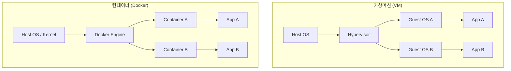
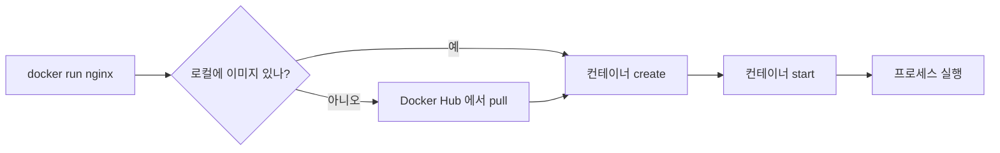



> *"내 컴퓨터에선 잘 되는데."*

배포 단계에서 가장 자주 듣는 이 한 문장이, 컨테이너라는 발상이 태어난 출발점입니다. 같은 코드가 개발자 PC, 동료 PC, 스테이징, 운영에서 각자 다르게 동작하는 카오스를 해결하려는 시도 — 그 결과물이 Docker 입니다.

이 글은 Docker 를 처음 만지는 입장에서 **다섯 가지 기본** 을 정리합니다. Docker 가 무엇인지, 가상머신과 어떻게 다른지, 이미지와 컨테이너의 관계, 첫 컨테이너를 띄우는 방법, 그리고 운영에서 가장 자주 쓰는 명령어들. 시리즈의 1편이고, 다음 편부터는 네트워크·Compose·이미지 빌드 심화 같은 주제를 따로 다룰 예정입니다.

## Docker 란?

Docker 는 **컨테이너 기반 가상화 플랫폼** 입니다. 풀어쓰면 — 애플리케이션과 그 실행에 필요한 모든 것 (라이브러리, 시스템 도구, 코드, 런타임) 을 **하나의 이미지로 묶고**, 그 이미지를 어떤 환경에서도 동일하게 실행할 수 있는 **격리된 프로세스(컨테이너)** 로 띄우는 도구입니다.

핵심 슬로건은 *"Build once, run anywhere"*.

기술적으로는 리눅스 커널의 두 가지 기능 위에 서 있습니다.

- **namespace** — 프로세스에게 "이 프로세스는 자기만의 PID 공간 · 네트워크 공간 · 파일시스템 공간을 보고 있다" 고 속이는 격리 메커니즘
- **cgroup** — CPU, 메모리, 디스크 I/O 같은 자원 사용량 제한

Docker 는 이 두 가지를 사용자가 직접 다루지 않아도 되도록 추상화한 도구입니다. macOS · Windows 에서는 백그라운드에서 가벼운 리눅스 VM 이 돌고 그 위에서 컨테이너가 뜹니다.

원래 이름은 dotCloud (2010년 PaaS 회사) → 2013년 Docker 로 분사 → 컨테이너 표준으로 자리잡았습니다.

## 컨테이너와 가상머신의 차이

가장 자주 헷갈리는 부분. 그림 한 장으로 차이가 분명해집니다.



핵심 차이를 표로 비교하면:

| | 가상머신 (VM) | 컨테이너 |
|---|---|---|
| **격리 단위** | 통째로 OS 한 대 | 프로세스 |
| **Guest OS** | 각각 따로 | 호스트 커널 공유 |
| **크기** | GB 단위 | MB 단위 |
| **시작 시간** | 수십 초 ~ 수 분 | 1~3초 |
| **격리 강도** | 강함 | 상대적으로 약함 (커널 공유) |
| **자원 효율** | 낮음 | 높음 |

비유로 정리하면, VM 은 **아파트 동 전체**, 컨테이너는 **아파트 한 호수** 입니다. 둘 다 격리는 되어 있지만 컨테이너는 같은 건물 (커널) 을 공유하므로 훨씬 가볍습니다.

그래서 보안이 매우 중요한 멀티 테넌트 환경에서는 VM 이 더 안전하고, 마이크로서비스처럼 같은 조직 내 여러 서비스를 띄우는 경우엔 컨테이너가 효율적입니다. 둘이 양자택일 관계는 아니고, 실제로는 "VM 위에서 컨테이너를 띄우는" 조합도 흔합니다 (AWS EC2 안에서 Docker 띄우기처럼).

## 이미지와 컨테이너 — 클래스와 인스턴스

가장 헷갈리는 두 단어. 객체지향 비유로 가장 빠르게 잡힙니다.

> **이미지 = 클래스, 컨테이너 = 인스턴스**

- **이미지** — 실행에 필요한 모든 것을 담은 **읽기 전용 스냅샷**. Dockerfile 로 빌드하거나 Docker Hub 같은 레지스트리에서 받습니다. 한 이미지로 컨테이너를 여러 개 띄울 수 있습니다.
- **컨테이너** — 이미지의 **실행 인스턴스**. 이미지 위에 **쓰기 가능한 레이어** 가 한 장 얹혀서, 컨테이너 안에서 파일을 만들거나 수정해도 원본 이미지는 변하지 않습니다.

이미지는 **레이어 구조** 입니다. 예를 들어 Python 앱이라면:

```
Layer 4: 내 앱 코드 복사
Layer 3: pip install 의존성
Layer 2: Python 3.11 설치
Layer 1: Ubuntu 22.04 베이스
```

각 레이어는 immutable 이고 캐싱됩니다. 코드만 바뀌면 Layer 1~3 은 캐시에서 재사용하고 Layer 4 만 다시 빌드됩니다. Dockerfile 작성 시 **자주 바뀌는 명령일수록 아래쪽에 두는** 이유가 여기 있습니다.

컨테이너는 임시적입니다. `docker rm` 으로 삭제하면 그 안에 쌓인 데이터는 같이 사라집니다. 영속 데이터가 필요하면 **볼륨(volume)** 으로 별도 관리해야 하는데, 이건 후속 편에서 다룹니다.

## 첫 컨테이너 띄우기

설치는 [Docker Desktop](https://www.docker.com/products/docker-desktop/) 에서. 설치 확인:

```powershell
docker --version
docker run hello-world
```

`hello-world` 는 Docker 가 검증용으로 제공하는 가장 작은 이미지입니다. 환영 메시지가 뜨면 정상.

조금 더 의미 있는 예제 — nginx 웹 서버를 띄워봅니다.

```powershell
docker run -d -p 8080:80 --name my-nginx nginx
```

옵션을 하나씩:

| 옵션 | 의미 |
|---|---|
| `-d` | **detached** — 백그라운드 실행. 안 붙이면 터미널이 컨테이너 로그에 묶임 |
| `-p 8080:80` | **port mapping** — 호스트의 8080 → 컨테이너의 80 으로 연결 |
| `--name my-nginx` | 컨테이너 이름. 안 주면 `vibrant_einstein` 같은 랜덤 이름이 붙음 |
| `nginx` | 사용할 이미지 이름 (`nginx:latest` 와 동일) |

브라우저에서 `http://localhost:8080` 접속하면 nginx 환영 페이지가 뜹니다.

`docker run` 한 줄의 내부 라이프사이클은 다음과 같습니다.



이 흐름을 이해하고 있으면 "왜 처음 실행은 느리고 두 번째부터는 빠른가" 같은 의문이 자연스럽게 풀립니다. 첫 실행은 이미지를 받아오는 과정이 있고, 두 번째부터는 캐시된 이미지를 바로 씁니다.

## 살아남는 데 필요한 명령어들

생존에 필요한 것만 추리면 다음 정도입니다.

```powershell
# 실행 중인 컨테이너 보기
docker ps

# 멈춘 것까지 모두 보기
docker ps -a

# 로컬 이미지 목록
docker images

# 로그 보기
docker logs my-nginx
docker logs -f my-nginx          # follow 모드 (tail -f 처럼)

# 컨테이너 안으로 들어가기 (셸 실행)
docker exec -it my-nginx bash

# 컨테이너 중지 / 삭제
docker stop my-nginx
docker rm my-nginx

# 이미지 삭제
docker rmi nginx

# 이미지 다운로드만
docker pull redis:7

# 한 번에 정리 (멈춘 컨테이너 + 안 쓰는 이미지 + 안 쓰는 네트워크)
docker system prune
```

특히 `docker exec -it <name> bash` 는 디버깅에서 가장 자주 씁니다. `-i` 는 interactive, `-t` 는 tty 할당. 컨테이너 안의 환경 변수, 파일 시스템, 프로세스 상태를 직접 확인할 때 필수입니다.

자주 헷갈리는 한 가지 — `docker run` 과 `docker start` 의 차이:

- `docker run` = **새 컨테이너 생성 + 시작**
- `docker start` = **기존 (멈춰 있는) 컨테이너 다시 시작**

같은 `--name` 으로 두 번 `run` 하면 *"이미 그 이름의 컨테이너가 있다"* 는 에러가 납니다. 이미 만든 컨테이너를 다시 띄우려면 `docker start my-nginx`.

## 가져갈 한 줄

> **이미지는 클래스, 컨테이너는 인스턴스, 둘을 헷갈리지 않으면 절반은 이해한 것이다.**

Docker 의 모든 명령어 (`run`, `ps`, `images`, `logs`, `exec`) 는 결국 이 두 가지 중 어느 쪽을 다루는지를 묻습니다. 명령어 앞에서 *"이건 이미지를 만지는 건가, 컨테이너를 만지는 건가?"* 한 번만 짚으면 옵션도 헷갈리지 않습니다.

다음 편은 컨테이너끼리 어떻게 통신하는지 — **Docker 네트워크** 를 다룹니다. `bridge`, `host`, custom network, port mapping 의 차이부터, 컨테이너 이름으로 DNS 처럼 서로 부르는 방법까지.

---

## 참고

- [Docker 공식 문서 — Get Started](https://docs.docker.com/get-started/)
- [Docker Desktop 다운로드](https://www.docker.com/products/docker-desktop/)
- [Docker Hub](https://hub.docker.com/) — 공개 이미지 레지스트리
