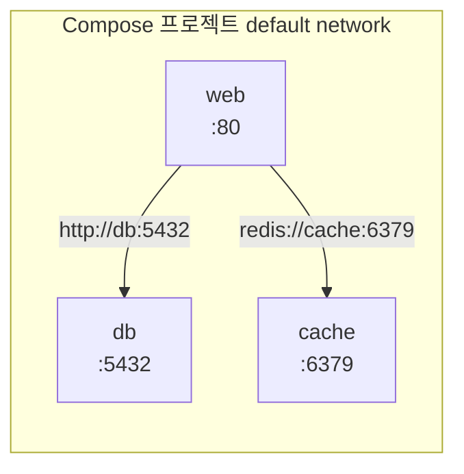



> **`docker run` 을 다섯 번 쳤다면, 그건 이미 Compose 의 신호입니다.**

웹 한 개, DB 한 개, 캐시 한 개, 그리고 둘을 잇는 custom network 까지. 손으로 띄우다 보면 어느 순간 README 에 "이 명령들을 순서대로 치세요" 가 5줄이 됩니다. 한 줄만 빠뜨려도 컨테이너 이름이 충돌하거나, 같은 네트워크에 안 붙어서 2편에서 봤던 *"왜 통신이 안 되지"* 가 재현됩니다.

Docker Compose 는 이 반복 작업을 YAML 파일 하나로 묶는 도구입니다. 이번 편은 Compose 가 왜 필요한지, `compose.yml` 의 최소 골격, 서비스끼리 이름으로 부르는 메커니즘, 그리고 운영에서 자주 밟는 함정인 `depends_on` 의 한계까지 정리합니다.

## docker run 다섯 줄 vs compose.yml 한 파일

먼저 2편에서 손으로 띄웠던 구성을 그대로 옮겨 봅니다.

```powershell
docker network create my-app
docker volume create pgdata

docker run -d --name db --network my-app `
  -e POSTGRES_PASSWORD=secret `
  -v pgdata:/var/lib/postgresql/data `
  postgres:16

docker run -d --name web --network my-app -p 8080:80 `
  -e DB_HOST=db `
  my-web-image
```

같은 걸 Compose 로 옮기면:

```yaml
# compose.yml
services:
  db:
    image: postgres:16
    environment:
      POSTGRES_PASSWORD: secret
    volumes:
      - pgdata:/var/lib/postgresql/data

  web:
    image: my-web-image
    ports:
      - "8080:80"
    environment:
      DB_HOST: db
    depends_on:
      - db

volumes:
  pgdata:
```

`docker compose up -d` 한 줄이면 됩니다. 네트워크는 명시하지 않아도 Compose 가 프로젝트 단위로 custom network 를 자동으로 만들어 줍니다 — 2편에서 *"DNS 가 동작하려면 custom network"* 라고 했던 그 조건이 기본으로 들어옵니다. 그래서 `web` 안에서 `db` 라는 이름이 그대로 호스트네임이 됩니다.

> 파일 이름은 `docker-compose.yml` 도 되고 `compose.yml` 도 됩니다. 신식은 `compose.yml`.

## 최소 골격 — services, networks, volumes

Compose 파일의 톱레벨은 우선 세 개만 먼저 보면 됩니다.

```yaml
services:   # 띄울 컨테이너들. 각 키가 서비스 이름이자 DNS 이름이 된다
  web:
    ...
  db:
    ...

networks:   # 명시하지 않으면 default 하나가 자동 생성된다
  ...

volumes:    # named volume 선언
  pgdata:
```

`version:` 필드를 본 적 있다면 잊어도 됩니다. v2 spec 부터는 권장되지 않는 필드입니다. 그대로 둬도 동작은 합니다.

가장 자주 쓰는 서비스 키만 추리면 다음과 같습니다.

| 키 | 역할 |
|---|---|
| `image` | 사용할 이미지 (없으면 `build:` 으로 직접 빌드) |
| `build` | Dockerfile 경로 또는 컨텍스트. `image` 와 같이 쓰면 빌드 결과에 그 이름이 붙는다 |
| `ports` | 호스트:컨테이너 매핑. `"8080:80"` 처럼 **문자열로** 적는 게 안전 |
| `environment` / `env_file` | 환경변수. 비밀 값은 `.env` 또는 `env_file` 로 분리 |
| `volumes` | bind mount (`./app:/app`) 또는 named volume (`pgdata:/var/lib/...`) |
| `depends_on` | 시작 순서 의존성 |
| `restart` | `no` / `on-failure` / `always` / `unless-stopped` |

## 서비스 이름이 DNS 가 된다

2편의 핵심 결론이 *"같은 custom network 에 있으면 컨테이너 이름이 호스트네임"* 이었습니다. Compose 는 이걸 기본 동작으로 만듭니다.



`web` 의 환경변수 `DB_HOST=db`, `REDIS_HOST=cache` 면 충분합니다. 호스트의 IP 도, 컨테이너 IP 도 신경 쓸 일이 없습니다. 같은 `compose.yml` 안에 있다는 것 자체가 "같은 그물 안" 을 보장합니다.

다른 Compose 프로젝트와 통신해야 할 때만 `networks:` 를 명시적으로 선언해서 `external: true` 로 공유합니다. 같은 프로젝트 안에서는 거의 손댈 일이 없습니다.

## `depends_on` 의 함정 — "시작" 과 "준비 완료" 는 다르다

처음 Compose 를 쓰는 사람이 거의 다 밟는 함정이 이겁니다.

```yaml
web:
  depends_on:
    - db
```

이렇게 적으면 *"db 가 켜진 뒤에 web 이 시작"* 됩니다. 하지만 켜진 것과 받을 준비가 된 건 다릅니다. `postgres:16` 컨테이너는 시작 직후 몇 초 동안 초기화 중이라 5432 포트가 아직 닫혀 있을 수 있습니다. 그 사이 `web` 이 부팅되어 DB 에 붙으려다 `connection refused` 로 죽습니다.

해결책은 **healthcheck + `condition: service_healthy`** 입니다.

```yaml
services:
  db:
    image: postgres:16
    environment:
      POSTGRES_PASSWORD: secret
    healthcheck:
      test: ["CMD-SHELL", "pg_isready -U postgres"]
      interval: 5s
      timeout: 3s
      retries: 10

  web:
    image: my-web-image
    depends_on:
      db:
        condition: service_healthy
```

이제 `web` 은 `pg_isready` 가 OK 를 돌려준 뒤에야 시작합니다. healthcheck 가 없는 이미지면 직접 만들어 줘야 하고, 만약 healthcheck 로직을 짜기 애매하면 **애플리케이션 쪽에 재시도 로직** 을 두는 게 더 단순합니다. 운영에서 DB 가 재시작될 수도 있으니, 클라이언트의 retry 는 결국 필요합니다.

## 환경변수와 `.env`

비밀 값은 Compose 파일에 박지 않고 같은 디렉토리의 `.env` 파일로 뺍니다.

```bash
# .env
POSTGRES_PASSWORD=secret
APP_SECRET_KEY=sk-xxxx
```

```yaml
# compose.yml
services:
  db:
    image: postgres:16
    environment:
      POSTGRES_PASSWORD: ${POSTGRES_PASSWORD}
```

⚠️ `.env` 는 **반드시 `.gitignore`** 에 추가합니다. 예시용으로 `.env.example` 만 키 이름과 더미 값으로 커밋해 두는 패턴이 흔합니다.

더 많은 변수를 서비스에 한꺼번에 주입하고 싶다면 `env_file: .env.web` 처럼 파일 단위로 묶는 것도 됩니다.

## 자주 쓰는 명령

```powershell
docker compose up -d           # 백그라운드로 전체 기동
docker compose down            # 전체 정리. -v 를 붙이면 named volume 도 삭제
docker compose ps              # 이 프로젝트의 컨테이너 상태
docker compose logs -f web     # web 서비스 로그 follow
docker compose exec web sh     # 실행 중인 web 컨테이너에 셸 진입
docker compose restart web     # 특정 서비스만 재시작
docker compose pull            # image 만 최신화
docker compose build           # build: 가 있는 서비스만 다시 빌드
```

`docker compose down -v` 는 named volume 까지 지웁니다. DB 데이터가 사라지므로 운영에서는 절대 금물.

## 개발 / 운영 — override 와 profile

같은 서비스를 개발에서는 소스 코드 마운트 + 핫리로드로, 운영에서는 빌드된 이미지로 띄우고 싶을 때가 많습니다. Compose 는 두 가지 장치를 줍니다.

**1) `compose.override.yml` 자동 병합**

`compose.yml` 옆에 `compose.override.yml` 이 있으면 `docker compose up` 이 자동으로 둘을 병합합니다. 개발용 오버라이드를 여기에 둡니다.

```yaml
# compose.override.yml — 로컬 전용
services:
  web:
    build: .
    volumes:
      - ./src:/app/src
    environment:
      DEBUG: "true"
```

운영 배포 시에는 override 가 없는 환경에서 `compose.yml` 만 적용되도록 두거나, `docker compose -f compose.yml -f compose.prod.yml up -d` 처럼 명시합니다.

**2) `profiles`**

특정 서비스를 평소엔 안 띄우고 필요할 때만 띄우고 싶을 때 (예: 디버그용 mailhog, e2e 테스트 러너).

```yaml
services:
  mailhog:
    image: mailhog/mailhog
    profiles: ["dev"]
```

`docker compose --profile dev up -d` 일 때만 같이 뜹니다.

## 남는 것

> **Compose 의 본질은 "여러 docker run + network create + volume create 를 한 파일에 적은 것" 그 이상도 이하도 아닙니다.**

그래서 1·2편의 모델, 즉 이미지/컨테이너와 네트워크/DNS 가 머리에 있으면 Compose 는 갑자기 어려워지지 않습니다. 새로 신경 쓸 점은 두 가지뿐입니다.

1. **`depends_on` 은 "시작 순서" 이지 "준비 완료" 가 아니다.** healthcheck 또는 클라이언트 재시도.
2. **비밀 값은 `.env` 로 빼고 `.gitignore` 에 올린다.**

다음 편은 이 구성에서 거의 손대지 않고 지나간 한 가지 — **볼륨과 데이터 영속화** — 를 다룰 예정입니다. 컨테이너를 지워도 DB 데이터는 살아 있어야 하는 이유, bind mount 와 named volume 의 차이, 그리고 운영에서 볼륨을 백업하는 패턴까지.

---

## 참고

- [Compose specification](https://docs.docker.com/compose/compose-file/)
- [Compose — services top-level element](https://docs.docker.com/compose/compose-file/05-services/)
- [Startup order in Compose — depends_on / healthcheck](https://docs.docker.com/compose/startup-order/)
