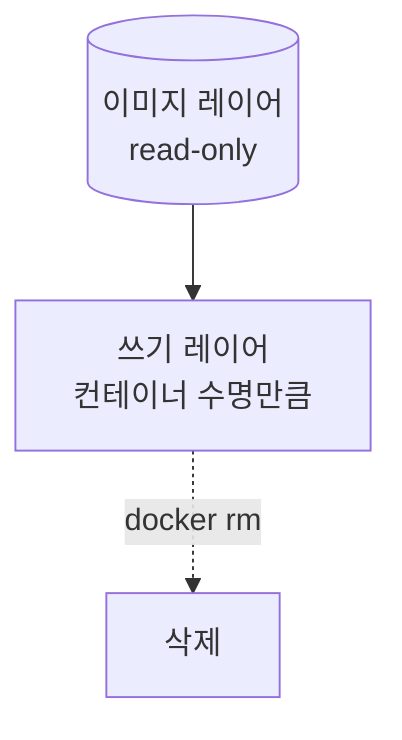
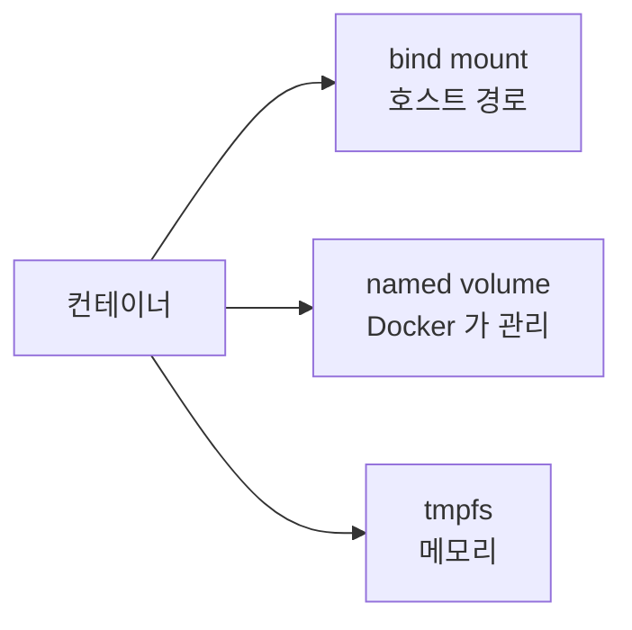



> **`docker compose down` 한 줄에 어제 만든 테스트 데이터가 통째로 사라집니다.**

정확히는 *컨테이너* 가 사라진 거지만, 컨테이너 안에 직접 들어 있던 파일은 같이 증발합니다. DB 컨테이너가 그렇게 날아가면 `postgres` 의 `/var/lib/postgresql/data` 가 새 디렉토리에서 다시 시작합니다. 즉 데이터베이스가 빈 상태로 부팅됩니다.

3편까지는 컨테이너를 띄우고 묶는 얘기였습니다. 4편의 주제는 단순합니다. **무엇을 컨테이너 안에 두고, 무엇을 바깥으로 빼낼 것인가.** 그 경계선이 바로 볼륨입니다.

## 컨테이너의 파일은 왜 사라지나

컨테이너는 이미지 위에 얇은 쓰기 레이어를 한 장 올린 것입니다.



컨테이너 안에서 파일을 만들면 그 쓰기 레이어에 쌓입니다. `docker rm` 으로 컨테이너를 지우는 순간 쓰기 레이어도 함께 사라집니다. 이미지는 그대로니까 다시 `docker run` 하면 새 컨테이너 + 새 빈 쓰기 레이어 — DB 입장에서는 "처음 부팅" 입니다.

영속화는 **"쓰기 레이어가 아닌 곳"** 에 데이터를 두는 것입니다. Docker 가 제공하는 그 "다른 곳" 은 크게 세 가지입니다.

## 세 가지 저장 방식



| 방식 | 위치 | 수명 | 관리 주체 |
|---|---|---|---|
| **bind mount** | 호스트의 특정 경로 (`./src`, `/etc/nginx`) | 호스트 파일이 남는 한 영원히 | 사용자 |
| **named volume** | Docker 가 관리하는 영역 (Linux 는 보통 `/var/lib/docker/volumes/...`) | `docker volume rm` 전까지 | Docker |
| **tmpfs** | 메모리 (RAM) | 컨테이너 종료까지 | 커널 |

세 가지가 다 같은 마운트 메커니즘을 쓰지만, **누가 그 데이터의 주인인가** 가 다릅니다. 그게 곧 "언제 무엇을 쓰는가" 의 기준이 됩니다.

## 언제 무엇을 쓰는가

실무에서 결정 기준은 복잡하지 않습니다. 이 글에서 가장 자주 펼쳐 볼 표는 아마 이것일 겁니다.

### bind mount — 호스트가 주인

```yaml
services:
  web:
    image: my-web-image
    volumes:
      - ./src:/app/src              # 개발: 호스트 소스를 컨테이너 안에 비춤
      - ./nginx.conf:/etc/nginx/nginx.conf:ro
```

**이걸 쓸 때:**
- **개발 중 핫리로드.** 호스트에서 소스를 수정하면 컨테이너 안에서 바로 보임. nodemon · uvicorn `--reload` 등과 짝.
- **호스트 설정 파일 주입.** nginx.conf, prometheus.yml 처럼 *호스트 git 으로 관리하고 싶은* 파일.
- **호스트의 디렉토리를 그대로 관찰·백업 대상으로 두고 싶을 때.** 예: 로그를 `./logs` 로 빼서 호스트 logrotate 가 처리.

**피해야 할 때:**
- 운영 DB 데이터. 호스트 경로 의존이 생기면 다른 머신 / 다른 OS 로 옮길 때 깨집니다. 권한 이슈도 잦습니다 (특히 Linux + `postgres` UID 충돌).
- 다른 OS 와 코드를 공유해야 하는 경우 — Windows 의 경로 / 대소문자 / 줄바꿈 이슈가 컨테이너 안까지 따라옵니다.

### named volume — Docker 가 주인

```yaml
services:
  db:
    image: postgres:16
    volumes:
      - pgdata:/var/lib/postgresql/data

volumes:
  pgdata:
```

**이걸 쓸 때:**
- **운영의 모든 상태성 데이터.** DB, 메시지 큐, 검색 인덱스, 캐시(영속화 옵션이 켜진 redis 등).
- **컨테이너를 갈아끼워도 데이터는 살아 있어야 할 때.** `docker compose down` 후 `up` 해도 DB 내용 그대로.
- **백업·복원을 Docker 명령으로 표준화하고 싶을 때.** 호스트 경로 의존이 없어서 다른 머신으로 볼륨만 옮기면 됩니다.

**피해야 할 때:**
- 호스트에서 자주 편집해야 하는 파일. named volume 은 호스트에서 직접 들여다보기 번거롭습니다.
- 개발 중인 소스 코드. 핫리로드 안 됩니다.

### tmpfs — 메모리만 쓰는 휘발 영역

```yaml
services:
  app:
    image: my-app
    tmpfs:
      - /tmp
      - /run/secrets:size=64m
```

**이걸 쓸 때:**
- **디스크에 절대 남기면 안 되는 데이터.** 복호화된 비밀, 단기 토큰.
- **휘발 OK 인 캐시·세션.** 컨테이너 재시작에 사라져도 무방한 임시 파일.

**피해야 할 때:**
- 영속화가 필요한 모든 데이터. 메모리니까 컨테이너가 죽으면 같이 죽습니다.

요약하면: **개발 중 호스트와 코드를 같이 보고 싶다 → bind. 운영 데이터를 보존하고 싶다 → named. 디스크에 남기면 안 되는 단기 데이터 → tmpfs.**

## 자주 밟는 함정 — Linux 의 권한 충돌

Linux 호스트에서 bind mount 를 쓸 때 가장 자주 만나는 메시지:

```
chown: changing ownership of '/var/lib/postgresql/data': Operation not permitted
FATAL: data directory has wrong ownership
```

원인은 단순합니다. 컨테이너 안의 `postgres` 유저 (보통 UID 999) 와 호스트의 디렉토리 소유자 UID 가 다른 겁니다. bind mount 는 호스트 파일시스템 권한을 그대로 들여다보기 때문에, 호스트의 디렉토리가 `root:root` 이면 컨테이너의 `postgres` 가 쓸 수 없습니다.

해결 방법은 두 갈래입니다.

**a) named volume 으로 갈아탄다 (권장).** Docker 가 마운트 시점에 소유권을 맞춰 줍니다. 운영 DB 라면 이쪽이 정답입니다.

**b) 굳이 bind 를 써야 한다면** 호스트 디렉토리의 UID 를 맞춥니다.

```bash
sudo chown -R 999:999 ./pgdata
```

또는 컨테이너의 사용자 UID 를 호스트와 맞춥니다 (`user: "1000:1000"` in compose).

> macOS · Windows 의 Docker Desktop 은 내부 VM 이 UID 매핑을 어느 정도 알아서 해 줘서 이 함정을 덜 만납니다. 운영(Linux) 으로 옮길 때 갑자기 터지는 게 보통입니다.

## 볼륨 운영 명령 한 줌

```powershell
docker volume ls                          # named volume 목록
docker volume inspect pgdata              # 마운트 포인트 / 드라이버 확인
docker volume rm pgdata                   # 볼륨 삭제 (사용 중이면 거부됨)
docker volume prune                       # 어디에도 안 붙은 볼륨 일괄 정리

docker compose down                       # 컨테이너만 정리 (볼륨 보존)
docker compose down -v                    # 컨테이너 + named volume 모두 삭제 ⚠️
```

`docker compose down -v` 는 정말로 데이터를 날립니다. 운영에서는 절대 쓰지 않고, 개발 환경에서도 "DB 를 초기 상태로 리셋하고 싶다" 가 명백할 때만 씁니다.

## 백업·복원 — 한 줄 트릭

named volume 은 호스트 경로가 깔끔하지 않아서 백업이 어색해 보이지만, 임시 컨테이너를 한 번 띄우면 깔끔합니다.

```powershell
# 백업: pgdata 볼륨을 호스트의 현재 디렉토리에 tar 로 떨군다
docker run --rm `
  -v pgdata:/data `
  -v ${PWD}:/backup `
  alpine `
  tar czf /backup/pgdata-$(Get-Date -Format yyyyMMdd).tar.gz -C /data .

# 복원: 빈 볼륨에 tar 를 풀어 넣는다
docker run --rm `
  -v pgdata:/data `
  -v ${PWD}:/backup `
  alpine `
  sh -c "cd /data && tar xzf /backup/pgdata-20260512.tar.gz"
```

핵심 아이디어: **백업할 볼륨을 `/data` 로, 호스트의 백업 대상 디렉토리를 `/backup` 으로 마운트한 일회용 컨테이너 안에서 tar 를 친다.** 같은 패턴이 모든 named volume 에 통합니다.

운영에서는 보통 DB 자체의 백업 도구 (`pg_dump`, `mongodump`) 를 우선 쓰고, 볼륨 단위 tar 는 머신 이전 / 빠른 스냅샷용으로 보조합니다.

## 가져갈 한 줄

> **"컨테이너를 지웠을 때 같이 사라져도 되는가" 를 물어봐서 답이 '아니오' 면 그 데이터는 볼륨에 있어야 합니다.**

볼륨은 결국 *지워도 되는 것* 과 *살아남아야 하는 것* 사이에 그어진 선입니다. 이미지·컨테이너는 언제든 다시 만들 수 있고, 그래야 합니다. 새 서비스를 띄울 때 가장 먼저 물어볼 건 *"이 컨테이너에서 사라지면 안 되는 파일이 무엇인가?"* 입니다. 그 답의 목록이 그대로 `volumes:` 섹션이 됩니다.

다음 편은 시리즈 도입부에서 마지막으로 남겨 둔 한 가지 — **Dockerfile 과 이미지 빌드 심화** — 입니다. 레이어 캐싱, 멀티스테이지 빌드, 이미지 슬리밍까지 다룰 예정입니다.

---

## 참고

- [Manage data in Docker](https://docs.docker.com/storage/)
- [Volumes](https://docs.docker.com/storage/volumes/)
- [Bind mounts](https://docs.docker.com/storage/bind-mounts/)
- [tmpfs mounts](https://docs.docker.com/storage/tmpfs/)
- [Back up, restore, or migrate data volumes](https://docs.docker.com/storage/volumes/#back-up-restore-or-migrate-data-volumes)
