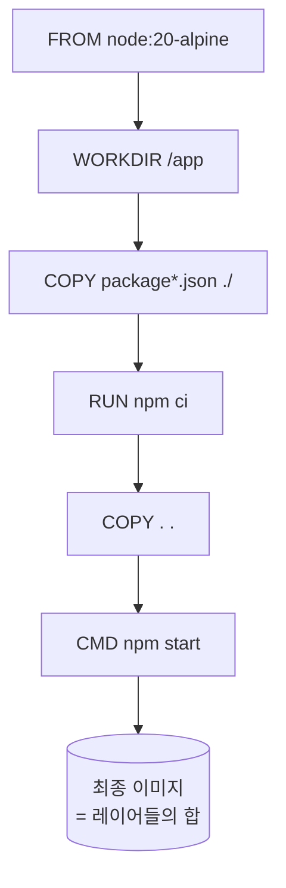



> **`docker build` 가 1분 30초 걸리던 게 8초로 줄었습니다. Dockerfile 의 줄 순서를 두 줄 바꿨을 뿐입니다.**

이미지 빌드는 처음엔 그냥 *"되기만 하면 됨"* 인 영역으로 보입니다. 그러다 CI 가 매 PR 마다 1분 30초씩 잡아먹고, 같은 머신에 1.2 GB 이미지가 계속 쌓이고, 운영 이미지에 `apt` 캐시까지 함께 배포되고 있다는 걸 깨닫습니다. 이때부터 Dockerfile 은 *작품* 이 됩니다.

시리즈의 마지막 5편입니다. 1편이 컨테이너, 2편이 네트워크, 3편이 Compose, 4편이 볼륨이었다면 이번 편은 **이미지 그 자체** — 어떻게 빌드되는지, 왜 캐시가 깨지는지, 어떻게 더 작고 안전하게 만드는지를 다룹니다.

## Dockerfile 한 줄 = 한 레이어

가장 먼저 잡아야 할 모델은 이겁니다. **Dockerfile 의 각 instruction 은 read-only 레이어 한 장으로 변환된다.**



각 레이어는 **명령어 텍스트 + 입력 파일들의 해시** 로 식별됩니다. 다음 빌드에서 그 식별자가 동일하면 Docker 는 레이어를 재사용합니다. 이게 캐시입니다. 한 줄이라도 바뀌면 *그 줄과 그 아래 모든 줄* 이 재실행됩니다.

## 캐시는 줄 순서가 만든다

이 사실 하나로 가장 유명한 패턴이 설명됩니다.

**나쁜 예:**

```dockerfile
FROM node:20-alpine
WORKDIR /app
COPY . .
RUN npm ci
CMD ["npm", "start"]
```

소스 코드 한 줄만 고쳐도 `COPY . .` 의 해시가 바뀝니다. 그 아래 `RUN npm ci` 도 같이 깨져서 `node_modules` 를 처음부터 다시 받습니다. 매번 1분 이상 까먹습니다.

**좋은 예:**

```dockerfile
FROM node:20-alpine
WORKDIR /app

# 1. 자주 안 바뀌는 의존성 매니페스트 먼저
COPY package*.json ./
RUN npm ci

# 2. 자주 바뀌는 소스 코드는 나중에
COPY . .

CMD ["npm", "start"]
```

`package.json` / `package-lock.json` 이 바뀌지 않는 한 `RUN npm ci` 의 캐시가 유지됩니다. 소스만 고친 빌드는 마지막 `COPY . .` 부터만 다시 실행 — 초 단위로 끝납니다.

> **규칙: 자주 안 바뀌는 줄은 위로, 자주 바뀌는 줄은 아래로.**

Python (`requirements.txt`), Java (`pom.xml`, `build.gradle`), Go (`go.mod`, `go.sum`) 도 똑같은 패턴입니다.

## `.dockerignore` — 빌드 컨텍스트를 좁힌다

`docker build` 는 첫 단계에서 현재 디렉토리 전체를 데몬으로 전송합니다. 이걸 **빌드 컨텍스트** 라고 부릅니다. 이 안에 `node_modules`, `.git`, `.env`, 로그 파일이 끼면:

- 전송 시간이 길어진다 (큰 디렉토리면 수십 초)
- `COPY . .` 의 해시가 의도치 않은 파일 때문에 자주 깨진다
- 비밀이 이미지 안에 들어갈 수 있다 (`.env` 가 그대로 따라 들어감)

해결책은 단순합니다. **`.dockerignore`** 를 둡니다.

```
.git
node_modules
dist
.env
.env.*
*.log
**/__pycache__
```

`.gitignore` 와 거의 같은 문법입니다. 이 한 파일이 캐시 적중률과 보안 양쪽을 동시에 챙겨 줍니다.

## 멀티스테이지 빌드 — 빌드 도구를 운영 이미지에서 빼낸다

작은 Node 앱을 빌드해서 정적 파일만 nginx 로 서빙한다고 합시다. 단일 스테이지로 짜면 최종 이미지에 Node·npm·소스 코드까지 다 들어갑니다. 1 GB 가 우습습니다.

```dockerfile
# 1단계: 빌드용
FROM node:20-alpine AS builder
WORKDIR /app
COPY package*.json ./
RUN npm ci
COPY . .
RUN npm run build       # /app/dist 가 만들어짐

# 2단계: 런타임용
FROM nginx:alpine AS runtime
COPY --from=builder /app/dist /usr/share/nginx/html
EXPOSE 80
CMD ["nginx", "-g", "daemon off;"]
```

최종 이미지에는 **두 번째 `FROM` 부터의 레이어만** 들어갑니다. nginx + 정적 파일 — 보통 30 MB 안쪽으로 떨어집니다. Node·npm·`node_modules` 는 빌드 단계에 남고 운영 이미지엔 흔적도 없습니다.

같은 패턴이 Java (Maven 빌드 → JRE 이미지), Go (빌드 → scratch), Rust (cargo build → distroless) 등 거의 모든 컴파일 언어에서 그대로 통합니다.

## 이미지 슬리밍 — base 와 RUN 합치기

베이스 이미지 선택만으로도 큰 차이가 납니다.

| 베이스 | 크기 | 트레이드오프 |
|---|---|---|
| `node:20` | ~1 GB | 디버깅 편하지만 무거움 |
| `node:20-slim` | ~250 MB | Debian 기반, 일반 패키지 호환 |
| `node:20-alpine` | ~150 MB | musl libc — 일부 네이티브 모듈 비호환 가능 |
| `gcr.io/distroless/nodejs20` | ~120 MB | 셸도 없음. 보안 최강, 디버깅 어려움 |

`apt` / `apk` 를 쓸 땐 **한 RUN 안에서 install → cleanup** 까지 묶습니다. 안 그러면 cleanup 레이어가 install 레이어 위에 쌓일 뿐 install 레이어 자체는 그대로 남습니다.

```dockerfile
# 나쁨 — 캐시는 지웠지만 레이어 크기는 그대로
RUN apt-get update && apt-get install -y curl
RUN rm -rf /var/lib/apt/lists/*

# 좋음 — 같은 레이어 안에서 청소까지
RUN apt-get update \
 && apt-get install -y --no-install-recommends curl \
 && rm -rf /var/lib/apt/lists/*
```

## 잊지 말아야 할 두 가지 — non-root, BuildKit 캐시 마운트

**non-root user.** 기본은 root 입니다. 컨테이너가 탈출당하면 root 권한이 그대로 새어 나갑니다. 마지막에 한 줄로 막습니다.

```dockerfile
RUN addgroup -S app && adduser -S app -G app
USER app
```

**BuildKit 캐시 마운트.** 의존성 매니페스트가 바뀌어 `npm ci` 가 다시 돌 때도, 패키지 캐시 자체는 빌드끼리 공유할 수 있습니다.

```dockerfile
# syntax=docker/dockerfile:1.6
FROM node:20-alpine
WORKDIR /app
COPY package*.json ./
RUN --mount=type=cache,target=/root/.npm \
    npm ci
COPY . .
CMD ["npm", "start"]
```

`/root/.npm` 이 빌드 사이에 영속됩니다. `requirements.txt` 가 바뀌어 `pip install` 이 다시 돌더라도 휠은 재사용됩니다. Go 의 `/root/.cache/go-build`, Rust 의 `~/.cargo/registry` 도 같은 트릭이 통합니다.

활성화는 `DOCKER_BUILDKIT=1 docker build ...` (구버전) 또는 그냥 최신 Docker 면 기본값. Dockerfile 첫 줄의 `# syntax=` 가 있어야 `--mount` 가 인식됩니다.

## 디버깅 — 어디가 부풀었는지 보는 법

이미지가 왜 크지? 캐시는 왜 자꾸 깨지지? 두 명령이 거의 다 답합니다.

```powershell
docker history my-image:latest
```

각 레이어가 어떤 instruction 이었고 크기가 얼마인지 위에서부터 보여 줍니다. 가장 굵은 줄을 찾아서 그걸 줄이거나 멀티스테이지로 옮기면 됩니다.

```powershell
docker build --progress=plain --no-cache .
```

캐시를 끄고 각 단계 로그를 풀로 보여 줍니다. *"왜 이 줄에서 캐시가 깨졌지"* 를 추적할 때 유용합니다.

## 가져갈 한 줄

> **Dockerfile 은 위에서 아래로 흐르는 캐시 파이프라인이고, 멀티스테이지는 그 파이프라인을 "빌드용" 과 "운영용" 으로 잘라 두는 도구입니다.**

이 모델만 머리에 있어도 빌드 시간은 짧아지고, 이미지 크기는 줄고, 운영 이미지에 빌드 도구가 섞이는 사고도 줄어듭니다. 평소에 챙길 건 단순합니다. *변하지 않는 줄은 위에, 변하는 줄은 아래에, 마지막은 USER 한 줄로 마무리.*

---

## 시리즈를 닫으며

다섯 편이 만든 그림은 결국 하나입니다.

- **1편 — 기초.** 같은 코드가 어디서나 같게 도는 단위로서의 컨테이너.
- **2편 — 네트워크.** 컨테이너들 사이의 통신은 "같은 그물 안에 있는가" 가 전부.
- **3편 — Compose.** 여러 컨테이너 + 네트워크 + 볼륨을 YAML 한 파일로.
- **4편 — 볼륨.** 지워도 되는 것과 살아남아야 하는 것 사이의 경계.
- **5편 — Dockerfile.** 그 컨테이너가 무엇으로부터 만들어지는가.

각 편은 다른 주제처럼 보였지만 결국 같은 질문에 답하고 있었습니다. *"이 컴퓨터에선 잘 되는데" 를 재현 가능하게 만들려면 무엇을 명시해야 하는가.* 환경(이미지), 연결(네트워크), 묶음(Compose), 상태(볼륨), 그리고 빌드 절차(Dockerfile) — 다섯 가지를 명시하면 거기서부터는 어디서 돌리든 같은 결과입니다.

여기까지 따라와 주셔서 감사합니다. Docker 가 손에 익은 다음 단계는 보통 **Kubernetes** 이지만, 그건 또 다른 시리즈의 몫으로 남겨두겠습니다.

---

## 참고

- [Dockerfile reference](https://docs.docker.com/engine/reference/builder/)
- [Best practices for writing Dockerfiles](https://docs.docker.com/develop/develop-images/dockerfile_best-practices/)
- [Multi-stage builds](https://docs.docker.com/build/building/multi-stage/)
- [BuildKit — cache mounts](https://docs.docker.com/build/cache/backends/)
- [.dockerignore](https://docs.docker.com/engine/reference/builder/#dockerignore-file)
