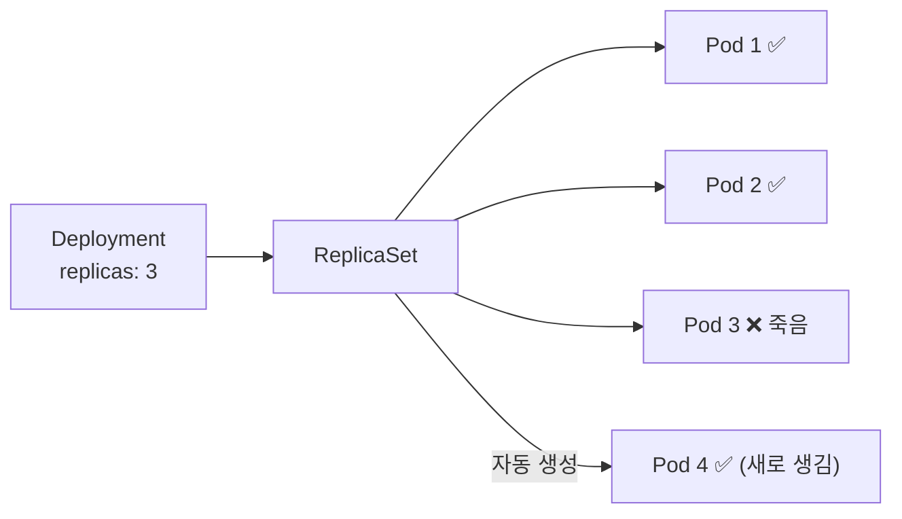
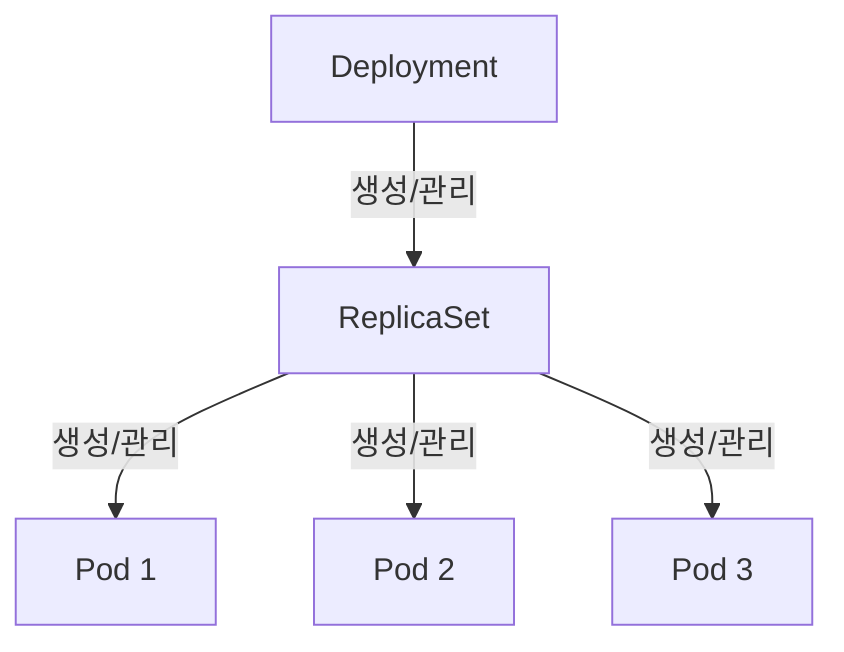
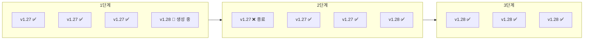



> **Pod 를 하나 띄웠습니다. 죽었습니다. 아무 일도 일어나지 않았습니다.**

2편에서 Pod 를 직접 만들어 봤습니다. `kubectl run` 한 줄이면 뜨고, `kubectl delete pod` 한 줄이면 사라집니다. 문제는 — 사라진 뒤에 아무도 다시 만들어 주지 않는다는 것입니다. 1편에서 이야기했던 "자동 복구(Self-healing)" 는 Pod 혼자서는 불가능합니다.

이번 편은 그 해답인 **Deployment** 를 다룹니다. "이 Pod 를 항상 N 개 유지해줘" 라는 선언 한 줄이, 자동 복구와 무중단 배포를 어떻게 만들어 내는지.

## Pod 만으로 부족한 이유

2편의 마지막에서 이런 실험을 해봤습니다:

```bash
kubectl run my-nginx --image=nginx
kubectl delete pod my-nginx
kubectl get pods
# → 아무것도 없다
```

Pod 가 죽으면 끝입니다. 다시 띄우려면 사람이 직접 `kubectl run` 을 쳐야 합니다. 이건 `docker run` 과 다를 게 없습니다.

운영 환경에서 필요한 건 이런 겁니다:

- Pod 가 죽으면 **자동으로 새로 만든다**
- 서버(노드) 가 죽어도 **다른 노드에서 다시 띄운다**
- 새 버전을 배포할 때 **하나씩 교체하면서 중단 없이** 진행한다
- 문제가 생기면 **이전 버전으로 롤백**한다

이 모든 걸 해주는 리소스가 **Deployment** 입니다.

## Deployment — "이 Pod 를 N 개 유지해줘"

Deployment 는 Pod 의 **관리자**입니다. Pod 를 직접 만드는 대신, Deployment 에게 "이런 Pod 를 몇 개 유지해줘" 라고 선언하면, Deployment 가 알아서 만들고, 감시하고, 복구합니다.

```yaml
# deployment.yaml
apiVersion: apps/v1
kind: Deployment
metadata:
  name: my-app
spec:
  replicas: 3
  selector:
    matchLabels:
      app: my-app
  template:
    metadata:
      labels:
        app: my-app
    spec:
      containers:
      - name: my-app
        image: nginx:1.27
        ports:
        - containerPort: 80
```

1편에서 한 번 보여줬던 매니페스트입니다. 이제 필드 하나씩 뜯어 봅니다.

| 필드 | 의미 |
|---|---|
| `replicas: 3` | Pod 를 3개 유지하라 |
| `selector.matchLabels` | 이 Deployment 가 관리할 Pod 를 라벨로 찾는다 |
| `template` | 만들 Pod 의 틀 (2편에서 봤던 Pod 매니페스트와 구조가 같다) |
| `template.metadata.labels` | 새로 만들 Pod 에 붙일 라벨 (selector 와 일치해야 한다) |

`selector` 와 `template.metadata.labels` 가 **반드시 일치**해야 합니다. Deployment 는 이 라벨로 "내가 관리하는 Pod" 를 식별합니다. 2편에서 배웠던 라벨과 셀렉터가 여기서 쓰입니다.

### Deployment 적용

```bash
kubectl apply -f deployment.yaml
```

```bash
kubectl get deployments
```

```
NAME     READY   UP-TO-DATE   AVAILABLE   AGE
my-app   3/3     3            3           15s
```

```bash
kubectl get pods
```

```
NAME                      READY   STATUS    RESTARTS   AGE
my-app-6d8f7b4b5c-abc12   1/1     Running   0          15s
my-app-6d8f7b4b5c-def34   1/1     Running   0          15s
my-app-6d8f7b4b5c-ghi56   1/1     Running   0          15s
```

Pod 이름 뒤에 랜덤 문자열이 붙어 있습니다. Deployment 가 만든 Pod 는 이름을 직접 정하지 않고, `<deployment 이름>-<replicaset 해시>-<pod 해시>` 형식으로 자동 생성됩니다.

### 자동 복구 확인

Pod 하나를 죽여 봅니다.

```bash
kubectl delete pod my-app-6d8f7b4b5c-abc12
kubectl get pods
```

```
NAME                      READY   STATUS    RESTARTS   AGE
my-app-6d8f7b4b5c-def34   1/1     Running   0          2m
my-app-6d8f7b4b5c-ghi56   1/1     Running   0          2m
my-app-6d8f7b4b5c-xyz99   1/1     Running   0          3s
```

죽인 Pod 대신 **새 Pod(`xyz99`) 가 자동으로 생겼습니다.** Deployment 가 "3개를 유지해야 한다" 는 선언을 기억하고 있기 때문입니다. 이게 2편에서 직접 만든 Pod 와의 결정적 차이입니다.



## ReplicaSet — Deployment 의 부하 직원

Pod 이름에 들어 있던 `6d8f7b4b5c` 는 뭘까요? 이건 **ReplicaSet** 의 해시입니다.

```bash
kubectl get replicasets
```

```
NAME                DESIRED   CURRENT   READY   AGE
my-app-6d8f7b4b5c   3         3         3       5m
```

Deployment 는 Pod 를 직접 만들지 않습니다. **ReplicaSet** 이라는 중간 관리자를 하나 더 둡니다.



역할 분담은 이렇습니다:

| 리소스 | 역할 |
|---|---|
| **Deployment** | 배포 전략 관리 (롤링 업데이트, 롤백). ReplicaSet 을 만든다 |
| **ReplicaSet** | Pod 복제본 수 유지. Pod 가 죽으면 새로 만든다 |
| **Pod** | 실제 컨테이너가 도는 최소 단위 |

그러면 ReplicaSet 을 직접 만들어서 쓰면 안 되나요? 됩니다. 하지만 **롤링 업데이트와 롤백 기능이 없습니다.** ReplicaSet 은 "지금 이 버전의 Pod 를 N 개 유지" 만 할 수 있고, 버전을 바꾸는 전략은 Deployment 가 처리합니다. 그래서 실무에서는 거의 항상 Deployment 를 쓰고, ReplicaSet 을 직접 만들 일은 없습니다.

## 스케일링 — 숫자 하나만 바꾸면 된다

트래픽이 늘어서 Pod 를 5개로 늘려야 한다면?

```bash
kubectl scale deployment my-app --replicas=5
```

또는 매니페스트의 `replicas: 5` 로 바꾸고 `kubectl apply -f deployment.yaml`.

```bash
kubectl get pods
```

```
NAME                      READY   STATUS    RESTARTS   AGE
my-app-6d8f7b4b5c-def34   1/1     Running   0          10m
my-app-6d8f7b4b5c-ghi56   1/1     Running   0          10m
my-app-6d8f7b4b5c-xyz99   1/1     Running   0          8m
my-app-6d8f7b4b5c-aaa11   1/1     Running   0          5s
my-app-6d8f7b4b5c-bbb22   1/1     Running   0          5s
```

1편에서 "서버마다 SSH 접속해서 수동으로 컨테이너를 띄움" 이라고 했던 문제가, 숫자 하나로 해결됩니다. 어느 노드에 배치할지는 Scheduler 가 알아서 결정합니다.

## 롤링 업데이트 — 무중단 배포

가장 실용적인 기능입니다. `nginx:1.27` 을 `nginx:1.28` 로 업데이트한다고 합시다.

매니페스트의 이미지를 바꾸고 적용합니다:

```bash
kubectl set image deployment/my-app my-app=nginx:1.28
```

또는 YAML 의 `image: nginx:1.28` 로 수정 후 `kubectl apply -f deployment.yaml`.

이때 K8s 는 **한 번에 전부 바꾸지 않습니다.** 기본 전략인 **롤링 업데이트(Rolling Update)** 로 진행합니다:



1. 새 버전 Pod 를 하나 만든다
2. 새 Pod 가 정상이면, 기존 Pod 하나를 종료한다
3. 전부 교체될 때까지 반복한다

사용자는 이 과정에서 중단을 느끼지 못합니다. 항상 일부 Pod 가 살아 있으니까요.

### 롤링 업데이트 진행 상황 확인

```bash
kubectl rollout status deployment/my-app
```

```
Waiting for deployment "my-app" rollout to finish: 1 out of 3 new replicas have been updated...
Waiting for deployment "my-app" rollout to finish: 2 out of 3 new replicas have been updated...
deployment "my-app" successfully rolled out
```

### 업데이트 속도 조절

매니페스트에서 롤링 업데이트의 속도를 조절할 수 있습니다:

```yaml
spec:
  strategy:
    type: RollingUpdate
    rollingUpdate:
      maxSurge: 1        # 동시에 추가로 만들 수 있는 Pod 수
      maxUnavailable: 0  # 동시에 사라질 수 있는 Pod 수
```

- `maxSurge: 1` — 기존 3개 + 1개까지, 최대 4개가 동시에 존재 가능
- `maxUnavailable: 0` — 항상 3개 이상이 떠 있어야 함 (완전 무중단)

## 롤백 — "이전 버전으로 돌려줘"

배포했는데 새 버전에 버그가 있다면?

```bash
# 배포 히스토리 확인
kubectl rollout history deployment/my-app
```

```
REVISION  CHANGE-CAUSE
1         <none>
2         <none>
```

```bash
# 바로 이전 버전으로 롤백
kubectl rollout undo deployment/my-app

# 특정 리비전으로 롤백
kubectl rollout undo deployment/my-app --to-revision=1
```

롤백도 롤링 업데이트와 같은 방식으로 점진적으로 진행됩니다. 이게 가능한 이유는 Deployment 가 **이전 ReplicaSet 을 삭제하지 않고 보관**하기 때문입니다.

```bash
kubectl get replicasets
```

```
NAME                DESIRED   CURRENT   READY   AGE
my-app-6d8f7b4b5c   0         0         0       20m    ← v1.27 (비활성)
my-app-7e9a8c5d6f   3         3         3       5m     ← v1.28 (활성)
```

롤백하면 이전 ReplicaSet 의 `DESIRED` 를 3으로 올리고, 현재 ReplicaSet 을 0으로 내립니다. 새 이미지를 다시 받을 필요도 없습니다.

## Deployment vs Pod vs ReplicaSet — 정리

| | Pod | ReplicaSet | Deployment |
|---|---|---|---|
| **자동 복구** | ❌ | ✅ | ✅ |
| **복제본 유지** | ❌ | ✅ | ✅ |
| **롤링 업데이트** | ❌ | ❌ | ✅ |
| **롤백** | ❌ | ❌ | ✅ |
| **직접 사용?** | 테스트 용도 | 거의 안 함 | ✅ 거의 항상 |

실무에서의 규칙은 단순합니다: **Pod 를 띄우고 싶으면 Deployment 를 만들어라.**

## 함정 — 자주 하는 실수

**1. selector 와 template labels 불일치**

```yaml
selector:
  matchLabels:
    app: my-app
template:
  metadata:
    labels:
      app: my-application  # ← 불일치!
```

이러면 Deployment 가 자기 Pod 를 찾지 못합니다. `apply` 시점에 에러가 나므로 발견은 쉽지만, 처음엔 왜 틀렸는지 모를 수 있습니다.

**2. replicas 를 0 으로 두면?**

```bash
kubectl scale deployment my-app --replicas=0
```

모든 Pod 가 내려갑니다. Deployment 자체는 남아 있으므로 다시 `--replicas=3` 으로 올리면 복구됩니다. 의도적으로 서비스를 잠시 내릴 때 쓸 수 있습니다.

**3. `kubectl set image` 에서 컨테이너 이름을 틀리면?**

```bash
kubectl set image deployment/my-app wrong-name=nginx:1.28
# error: the server could not find the container "wrong-name"
```

`my-app=nginx:1.28` 에서 `my-app` 은 Deployment 이름이 아니라 **`spec.containers[].name`** 입니다. 매니페스트의 컨테이너 이름과 일치해야 합니다.

## 가져갈 한 줄

> **Pod 는 직접 만들지 말고, Deployment 에게 맡겨라 — 자동 복구, 스케일링, 무중단 배포가 공짜로 따라온다.**

Deployment 가 ReplicaSet 을 만들고, ReplicaSet 이 Pod 를 만든다. 이 3단 구조를 알고 있으면, `kubectl get pods` 에 찍히는 긴 이름이 더 이상 낯설지 않습니다.

다음 편에서는 이 Pod 들에 **어떻게 접근하는가** 를 다룹니다. Pod 는 죽었다 살아날 때마다 IP 가 바뀝니다. 그러면 다른 서비스가 이 Pod 를 어떻게 찾나요? 그 문제를 풀어주는 것이 **Service** 입니다.

---

## 참고

- [Kubernetes 공식 문서 — Deployments](https://kubernetes.io/docs/concepts/workloads/controllers/deployment/)
- [Kubernetes 공식 문서 — ReplicaSet](https://kubernetes.io/docs/concepts/workloads/controllers/replicaset/)
- [Kubernetes 시리즈 2편 — 첫 클러스터와 Pod](/posts/k8s-pod-basics/)
