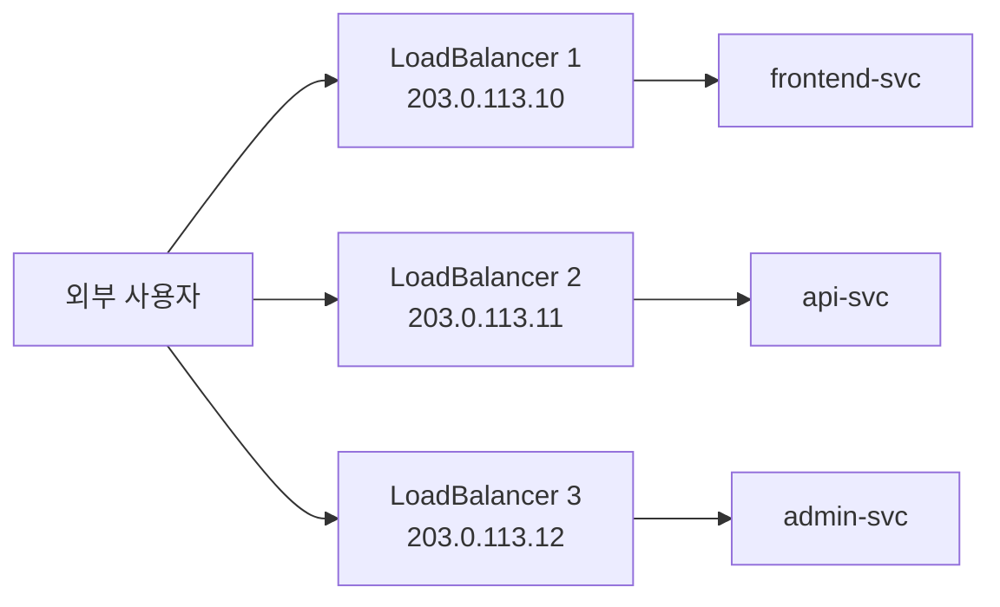
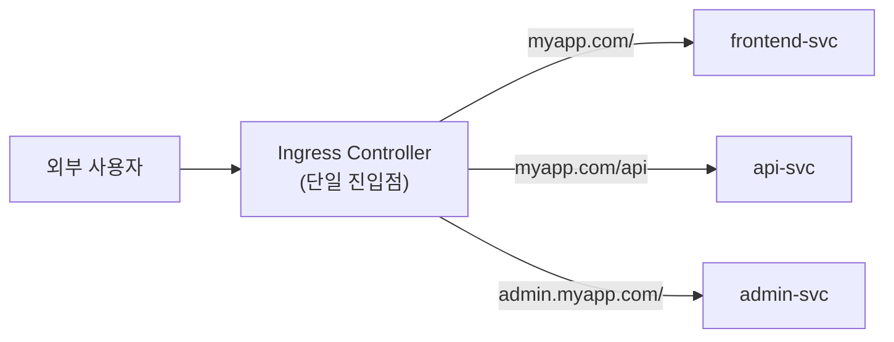
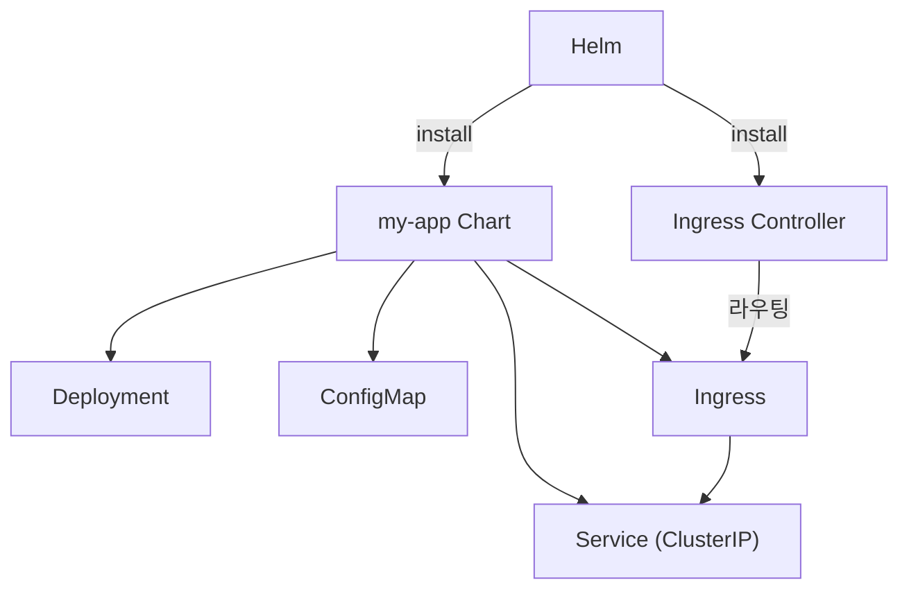
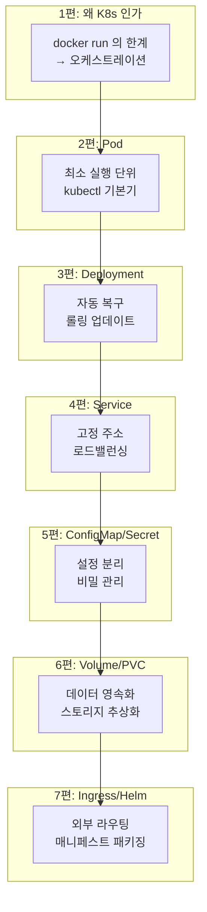



> **Service 가 열 개가 되니까, LoadBalancer 도 열 개가 필요해졌습니다.**

4편에서 Service 의 세 가지 타입을 배웠습니다. 외부에 노출하려면 LoadBalancer 를 쓰면 된다고 했는데, 서비스가 늘어나면 문제가 생깁니다. LoadBalancer 하나당 클라우드 로드밸런서 하나가 생기고, 그건 곧 비용입니다. 게다가 도메인 하나에 경로별로 다른 서비스를 보내고 싶다면? LoadBalancer 만으로는 안 됩니다.

그리고 시리즈를 따라오면서 YAML 파일이 계속 늘어났습니다. Deployment, Service, ConfigMap, Secret, PVC. 서비스 하나에 파일이 다섯 개씩 생깁니다. 환경별로 값만 다른 거의 같은 파일을 복사·붙여넣기하고 있다면, 뭔가 잘못되고 있는 겁니다.

시리즈의 마지막 편에서는 이 두 가지를 다룹니다: 외부 트래픽을 깔끔하게 라우팅하는 **Ingress**, 그리고 매니페스트를 패키징하는 **Helm**.

## Ingress — 하나의 입구로 여러 서비스를 라우팅

### LoadBalancer 의 한계

4편에서 본 구조를 다시 봅니다:



서비스마다 LoadBalancer 를 만들면:
- 공인 IP 가 여러 개 필요하다 (비용)
- 도메인이 서비스마다 따로 필요하거나, DNS 설정이 복잡해진다
- HTTPS 인증서도 각각 관리해야 한다

우리가 원하는 건 이런 겁니다:

```
https://myapp.com/         → frontend-svc
https://myapp.com/api      → api-svc
https://admin.myapp.com/   → admin-svc
```

하나의 입구에서 **도메인과 경로**에 따라 트래픽을 분배하는 것. 이게 **Ingress** 의 역할입니다.

### Ingress 리소스

```yaml
# ingress.yaml
apiVersion: networking.k8s.io/v1
kind: Ingress
metadata:
  name: my-ingress
spec:
  rules:
  - host: myapp.com
    http:
      paths:
      - path: /
        pathType: Prefix
        backend:
          service:
            name: frontend-svc
            port:
              number: 80
      - path: /api
        pathType: Prefix
        backend:
          service:
            name: api-svc
            port:
              number: 80
  - host: admin.myapp.com
    http:
      paths:
      - path: /
        pathType: Prefix
        backend:
          service:
            name: admin-svc
            port:
              number: 80
```

구조는 직관적입니다:

| 필드 | 의미 |
|---|---|
| `rules[].host` | 이 도메인으로 들어오는 요청을 처리 |
| `paths[].path` | URL 경로 매칭 |
| `paths[].pathType` | `Prefix` (경로 시작 매칭) 또는 `Exact` (정확히 일치) |
| `backend.service` | 트래픽을 보낼 Service 이름과 포트 |

Ingress 를 적용하면 구조가 이렇게 바뀝니다:



LoadBalancer 하나, 공인 IP 하나로 여러 서비스를 라우팅합니다.

### Ingress Controller — Ingress 를 실행하는 엔진

여기서 중요한 포인트. **Ingress 리소스만 만든다고 동작하지 않습니다.** Ingress 는 "이렇게 라우팅해줘" 라는 **규칙**일 뿐이고, 이 규칙을 실제로 실행하는 것이 **Ingress Controller** 입니다.

Ingress Controller 는 K8s 에 기본 포함되어 있지 않습니다. 별도로 설치해야 합니다. 가장 많이 쓰이는 것이 **NGINX Ingress Controller** 입니다.

```bash
# minikube 에서 NGINX Ingress Controller 활성화
minikube addons enable ingress
```

다른 환경에서는 Helm 으로 설치하는 것이 일반적입니다 (뒤에서 다룹니다).

주요 Ingress Controller:

| 이름 | 특징 |
|---|---|
| **NGINX Ingress Controller** | 가장 널리 사용. 커뮤니티판과 상용판 존재 |
| **Traefik** | 자동 설정, Let's Encrypt 통합이 쉬움 |
| **AWS ALB Ingress Controller** | AWS ALB 와 직접 연동 |

### HTTPS — TLS 인증서 적용

Ingress 에서 HTTPS 를 설정하려면 TLS 인증서를 Secret 으로 만들고 참조합니다:

```yaml
apiVersion: networking.k8s.io/v1
kind: Ingress
metadata:
  name: my-ingress
spec:
  tls:
  - hosts:
    - myapp.com
    secretName: myapp-tls    # TLS 인증서가 담긴 Secret
  rules:
  - host: myapp.com
    http:
      paths:
      - path: /
        pathType: Prefix
        backend:
          service:
            name: frontend-svc
            port:
              number: 80
```

```bash
# TLS Secret 생성
kubectl create secret tls myapp-tls \
  --cert=tls.crt \
  --key=tls.key
```

5편에서 배운 Secret 이 여기서도 쓰입니다. 실무에서는 **cert-manager** 라는 도구를 설치해서 Let's Encrypt 인증서를 자동 발급·갱신하는 것이 일반적입니다.

## Helm — 매니페스트 패키징

### YAML 이 늘어나면 생기는 문제

시리즈를 따라오면서 만든 파일을 세어 봅니다:

```
deployment.yaml
service.yaml
configmap.yaml
secret.yaml
pvc.yaml
ingress.yaml
```

서비스 하나에 파일이 여섯 개. 서비스가 세 개면 열여덟 개. 여기에 개발·스테이징·운영 환경별로 값이 다르면?

- `deployment-dev.yaml`, `deployment-staging.yaml`, `deployment-prod.yaml`
- 파일이 거의 같은데 `image` 태그, `replicas`, `DB_HOST` 만 다르다
- 하나를 수정하면 나머지도 전부 맞춰야 한다

이 문제를 풀어주는 것이 **Helm** 입니다.

### Helm 이란

**Helm** 은 K8s 의 **패키지 매니저**입니다. `apt`(Ubuntu)나 `npm`(Node.js)이 소프트웨어를 패키지로 관리하듯, Helm 은 K8s 매니페스트를 **Chart** 라는 패키지로 관리합니다.

핵심 아이디어: **YAML 을 템플릿으로 만들고, 환경별로 값만 바꿔 넣는다.**

### Chart 의 구조

```
my-app/
├── Chart.yaml          # Chart 메타데이터 (이름, 버전)
├── values.yaml         # 기본값 정의
└── templates/          # YAML 템플릿들
    ├── deployment.yaml
    ├── service.yaml
    ├── configmap.yaml
    └── ingress.yaml
```

### 템플릿 예시

일반 YAML:

```yaml
# 기존 deployment.yaml
spec:
  replicas: 3
  template:
    spec:
      containers:
      - name: my-app
        image: my-app:1.0
```

Helm 템플릿:


```yaml
# templates/deployment.yaml
spec:
  replicas: {{ .Values.replicaCount }}
  template:
    spec:
      containers:
      - name: {{ .Chart.Name }}
        image: "{{ .Values.image.repository }}:{{ .Values.image.tag }}"
```


`values.yaml`:

```yaml
# values.yaml (기본값)
replicaCount: 3
image:
  repository: my-app
  tag: "1.0"
```

`{{ .Values.xxx }}` 자리에 `values.yaml` 의 값이 들어갑니다. 환경별로 값만 다른 파일을 만들면 됩니다:

```yaml
# values-prod.yaml (운영 환경용)
replicaCount: 5
image:
  repository: my-app
  tag: "2.0"
```

### Helm 기본 명령어

```bash
# Helm 설치 (macOS)
brew install helm

# Chart 설치 (= 매니페스트 배포)
helm install my-release ./my-app

# 환경별 values 파일 지정
helm install my-release ./my-app -f values-prod.yaml

# 업그레이드
helm upgrade my-release ./my-app -f values-prod.yaml

# 롤백
helm rollback my-release 1

# 설치된 릴리스 목록
helm list

# 삭제
helm uninstall my-release
```

| 명령어 | 역할 |
|---|---|
| `helm install` | Chart 를 클러스터에 배포 |
| `helm upgrade` | 기존 릴리스를 업데이트 |
| `helm rollback` | 이전 버전으로 되돌리기 |
| `helm list` | 설치된 릴리스 목록 |
| `helm uninstall` | 릴리스 삭제 (관련 리소스 전부 제거) |

### 공개 Chart — 바퀴를 다시 만들지 않는다

Helm 의 또 다른 강점은 **공개 Chart 저장소**입니다. 직접 만들 필요 없이, 이미 잘 만들어진 Chart 를 가져다 쓸 수 있습니다.

```bash
# 저장소 추가
helm repo add bitnami https://charts.bitnami.com/bitnami
helm repo update

# PostgreSQL 을 Helm 으로 한 줄에 설치
helm install my-postgres bitnami/postgresql

# NGINX Ingress Controller 설치
helm repo add ingress-nginx https://kubernetes.github.io/ingress-nginx
helm install ingress-nginx ingress-nginx/ingress-nginx
```

6편에서 PostgreSQL 을 배포하려고 Deployment + PVC + Service 를 직접 작성했습니다. Helm 을 쓰면 `helm install` 한 줄로 끝납니다. 레플리케이션, 백업, 모니터링 설정까지 `values.yaml` 로 조절 가능합니다.

## Ingress + Helm — 조합하면

실무에서 흔한 패턴을 정리하면:

1. **Ingress Controller** 를 Helm 으로 설치 (`helm install ingress-nginx ...`)
2. 각 서비스를 **Helm Chart** 로 패키징
3. 환경별 `values-dev.yaml`, `values-prod.yaml` 로 설정 분리
4. **Ingress 리소스**로 도메인·경로 라우팅 설정



Service 는 ClusterIP 로 두고, 외부 노출은 Ingress 가 담당합니다. LoadBalancer 는 Ingress Controller 한 곳에만 붙으므로 비용이 절약됩니다.

## 함정 — 자주 하는 실수

**1. Ingress Controller 없이 Ingress 리소스만 만든다**

Ingress YAML 을 적용해도 아무 일이 일어나지 않습니다. `kubectl get ingress` 에서 `ADDRESS` 가 비어 있으면 Ingress Controller 가 설치되지 않은 것입니다.

**2. pathType 을 빠뜨린다**

```yaml
paths:
- path: /api
  # pathType 이 없으면 에러!
  backend:
    service:
      name: api-svc
      port:
        number: 80
```

K8s 1.22 부터 `pathType` 은 필수입니다. `Prefix` 또는 `Exact` 를 반드시 지정해야 합니다.

**3. Helm values 에서 들여쓰기를 잘못한다**

YAML 이니까 들여쓰기가 곧 구조입니다. `values.yaml` 에서 들여쓰기를 잘못하면 값이 엉뚱한 곳에 들어가거나 파싱 에러가 납니다. `helm template` 명령으로 렌더링 결과를 미리 확인하는 습관이 좋습니다:

```bash
helm template my-release ./my-app -f values-prod.yaml
```

## 시리즈 회고 — 1편부터 7편까지

7편에 걸쳐 Kubernetes 의 핵심 개념을 하나씩 쌓아 왔습니다. 마지막으로 전체 흐름을 한 장으로 정리합니다:



| 편 | 핵심 한 줄 |
|---|---|
| 1편 | K8s 는 "이 상태를 유지해줘" 라고 적으면 나머지를 알아서 하는 시스템 |
| 2편 | Pod 는 최소 단위이지만, 운영에서 직접 만들지는 않는다 |
| 3편 | Pod 는 Deployment 에게 맡겨라 — 자동 복구와 무중단 배포가 따라온다 |
| 4편 | Pod IP 는 임시, Service IP 는 고정 — 항상 Service 를 통해 접근 |
| 5편 | 이미지는 하나, 설정은 ConfigMap 에, 비밀은 Secret 에 |
| 6편 | Docker 의 -v 가 K8s 에서는 PVC — 디스크를 추상화 |
| 7편 | 하나의 입구(Ingress)로 여러 서비스 라우팅, Helm 으로 매니페스트 패키징 |

## 가져갈 한 줄

> **Ingress 는 여러 Service 를 하나의 입구로 묶어주고, Helm 은 늘어나는 YAML 을 하나의 패키지로 묶어준다.**

이 시리즈는 "K8s 가 뭔지 전혀 모르는 상태" 에서 "핵심 개념을 한 바퀴 돌아본 상태" 까지를 목표로 했습니다. 여기서 다루지 못한 것도 많습니다 — StatefulSet, DaemonSet, Job, HPA(오토스케일링), 네트워크 정책, 모니터링, CI/CD 연동 같은 주제는 실무에서 하나씩 마주하게 됩니다.

하지만 이 7편의 개념을 잡고 있으면, 새로운 주제를 만났을 때 "이건 어디에 해당하는 이야기인가" 를 잡아낼 수 있습니다. 그게 이 시리즈가 남기고 싶었던 것입니다.

---

## 참고

- [Kubernetes 공식 문서 — Ingress](https://kubernetes.io/docs/concepts/services-networking/ingress/)
- [Kubernetes 공식 문서 — Ingress Controllers](https://kubernetes.io/docs/concepts/services-networking/ingress-controllers/)
- [Helm 공식 문서](https://helm.sh/docs/)
- [Artifact Hub — 공개 Helm Chart 검색](https://artifacthub.io/)
- [NGINX Ingress Controller](https://kubernetes.github.io/ingress-nginx/)
