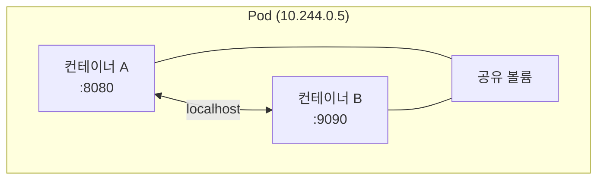
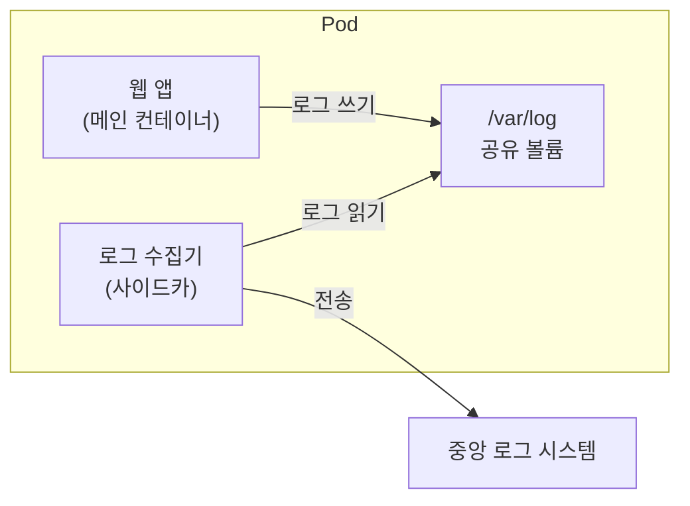



> **컨테이너가 K8s 의 최소 단위라고 생각했는데, 아니었습니다.**

Docker 에서는 컨테이너 하나가 실행의 단위였습니다. `docker run` 하나로 프로세스 하나가 뜨고, 그게 기본 단위였습니다. K8s 로 넘어오면 최소 단위가 컨테이너가 아니라 **Pod** 입니다.

컨테이너를 한 겹 더 감싼 이 단위가 왜 필요한지, 그리고 그 Pod 를 띄우려면 먼저 클러스터가 있어야 하니, 로컬에 클러스터부터 하나 만들어 보겠습니다.

## 로컬 클러스터 — 내 PC 에 K8s 띄우기

K8s 를 써보려면 클러스터가 필요합니다. AWS 나 GCP 에 올리기 전에, 내 PC 에서 먼저 실험할 수 있는 도구가 두 가지 있습니다.

| 도구 | 특징 |
|---|---|
| **minikube** | VM 또는 Docker 컨테이너 안에 단일 노드 클러스터 생성. 가장 널리 쓰이는 로컬 도구 |
| **kind** (Kubernetes IN Docker) | Docker 컨테이너를 노드로 사용. 멀티 노드 클러스터도 가능. CI 에서도 자주 사용 |

이 글에서는 **minikube** 를 기준으로 진행합니다. Docker Desktop 이 설치되어 있다면 가장 빠르게 따라올 수 있습니다.

### minikube 설치와 클러스터 생성

```bash
# macOS (Homebrew)
brew install minikube

# Windows (Chocolatey)
choco install minikube

# Linux
curl -LO https://storage.googleapis.com/minikube/releases/latest/minikube-linux-amd64
sudo install minikube-linux-amd64 /usr/local/bin/minikube
```

설치 후 클러스터를 하나 띄웁니다.

```bash
minikube start
```

처음 실행하면 K8s 이미지를 받느라 1~2분 걸립니다. 완료되면 이런 메시지가 뜹니다:

```
🏄  Done! kubectl is now configured to use "minikube" cluster
```

이 한 줄이 뜨면 로컬에 컨트롤 플레인 + 워커 노드가 하나로 합쳐진 단일 노드 클러스터가 돌고 있는 겁니다.

### kubectl — K8s 와 대화하는 도구

1편에서 잠깐 언급했던 **kubectl** 을 본격적으로 씁니다. kubectl 은 K8s 클러스터에 명령을 보내는 CLI 도구입니다. minikube 를 설치하면 kubectl 도 함께 들어오는 경우가 많지만, 없다면 별도 설치합니다.

```bash
# 클러스터 정보 확인
kubectl cluster-info

# 노드 목록
kubectl get nodes
```

```
NAME       STATUS   ROLES           AGE   VERSION
minikube   Ready    control-plane   1m    v1.31.0
```

노드가 하나 보입니다. 로컬 클러스터이므로 컨트롤 플레인과 워커 노드가 한 몸입니다. 운영 환경에서는 이 둘이 분리됩니다.

## Pod 란 — "왜 컨테이너가 아니라 Pod 인가"

K8s 에서 가장 작은 배포 단위는 **컨테이너가 아니라 Pod** 입니다.

> **Pod = 함께 살고, 함께 죽는 컨테이너 묶음**

Pod 안의 컨테이너들은 다음을 공유합니다:

- **네트워크** — 같은 IP 주소를 쓴다. `localhost` 로 서로 통신 가능
- **스토리지** — 같은 볼륨을 마운트할 수 있다
- **라이프사이클** — Pod 가 죽으면 안의 컨테이너도 전부 죽는다



그런데 왜 이런 단위가 필요할까요? 컨테이너 하나면 되지 않나요?

### 사이드카 패턴

실제로 Pod 에 컨테이너를 여러 개 넣는 가장 대표적인 사례가 **사이드카(sidecar)** 패턴입니다.

예를 들어, 메인 웹 앱이 로그를 파일로 남긴다고 합시다. 이 로그를 수집해서 중앙 로그 시스템으로 보내는 에이전트가 필요합니다.



- 웹 앱은 `/var/log` 에 로그를 쓴다
- 로그 수집기는 같은 볼륨에서 로그를 읽어서 외부로 전송한다
- 둘은 같은 Pod 안에 있으니 볼륨을 공유하고, 같이 배포되고, 같이 죽는다

이 두 컨테이너를 별도 Pod 로 분리하면? 볼륨 공유가 안 되고, 네트워크도 달라지고, 배포·스케일링도 따로 관리해야 합니다. **"항상 함께 다녀야 하는 컨테이너"** 를 묶는 단위가 Pod 인 겁니다.

물론, **대부분의 Pod 는 컨테이너 하나만 갖습니다.** 사이드카가 필요한 경우가 아니라면 Pod = 컨테이너 1개인 경우가 훨씬 많습니다. "Pod 는 컨테이너 여러 개를 담을 수 있는 그릇이고, 보통은 하나만 담는다" 가 현실적인 이해입니다.

## 첫 Pod 띄우기

Pod 를 만드는 방법은 두 가지입니다.

### 방법 1: kubectl run (빠른 테스트용)

```bash
kubectl run my-nginx --image=nginx --port=80
```

Docker 의 `docker run` 과 비슷하지만, 이건 **컨테이너가 아니라 Pod** 를 만드는 명령입니다.

```bash
kubectl get pods
```

```
NAME       READY   STATUS    RESTARTS   AGE
my-nginx   1/1     Running   0          10s
```

`1/1` 은 "Pod 안에 컨테이너가 1개이고, 1개가 정상 가동 중" 이라는 뜻입니다.

### 방법 2: YAML 매니페스트 (운영에서 쓰는 방식)

```yaml
# pod.yaml
apiVersion: v1
kind: Pod
metadata:
  name: my-nginx
  labels:
    app: nginx
spec:
  containers:
  - name: nginx
    image: nginx
    ports:
    - containerPort: 80
```

```bash
kubectl apply -f pod.yaml
```

필드를 하나씩 보면:

| 필드 | 의미 |
|---|---|
| `apiVersion: v1` | Pod 는 K8s 의 핵심 API 에 속한다 |
| `kind: Pod` | 만들 리소스의 종류 |
| `metadata.name` | Pod 의 이름 |
| `metadata.labels` | Pod 에 붙이는 태그 (뒤에서 셀렉터가 이걸로 Pod 를 찾는다) |
| `spec.containers` | Pod 안에 들어갈 컨테이너 목록 |
| `containers[].image` | 컨테이너가 쓸 이미지 |
| `containers[].ports` | 열어둘 포트 (문서화 목적, 실제 접근은 Service 로 한다) |

1편에서 봤던 Deployment 매니페스트보다 훨씬 짧습니다. Pod 는 K8s 에서 가장 단순한 리소스이고, Deployment 는 Pod 위에 추가 기능을 얹은 것입니다 — 이건 3편에서 다룹니다.

## Pod 살펴보기 — kubectl 기본기

Pod 를 만들었으면, 상태를 확인하고 디버깅하는 방법을 알아야 합니다.

```bash
# Pod 목록 (기본)
kubectl get pods

# 더 자세한 정보 (IP, 노드 등)
kubectl get pods -o wide

# Pod 의 상세 정보 (이벤트, 조건, 볼륨 등)
kubectl describe pod my-nginx

# Pod 의 로그
kubectl logs my-nginx

# Pod 안으로 들어가기 (docker exec 와 동일)
kubectl exec -it my-nginx -- bash

# Pod 삭제
kubectl delete pod my-nginx
```

Docker 명령어와 대응시키면:

| Docker | kubectl | 설명 |
|---|---|---|
| `docker ps` | `kubectl get pods` | 실행 중인 컨테이너/Pod 목록 |
| `docker logs` | `kubectl logs` | 로그 확인 |
| `docker exec -it` | `kubectl exec -it` | 내부 셸 접속 |
| `docker inspect` | `kubectl describe` | 상세 정보 |
| `docker rm` | `kubectl delete pod` | 삭제 |

이미 Docker 명령어에 익숙하다면, `docker` 를 `kubectl` 로 바꾸고 `컨테이너 이름` 을 `pod 이름` 으로 바꾸면 됩니다.

### Pod 에 접속해 보기

minikube 환경에서 Pod 안의 nginx 에 접속하려면:

```bash
# Pod 의 80 포트를 로컬의 8080 으로 포워딩
kubectl port-forward my-nginx 8080:80
```

브라우저에서 `http://localhost:8080` 을 열면 nginx 환영 페이지가 뜹니다. Docker 의 `-p 8080:80` 과 비슷한 역할이지만, 이건 디버깅용 임시 터널입니다. 운영에서 외부 트래픽을 받으려면 **Service** 가 필요합니다 — 4편에서 다룹니다.

## 네임스페이스, 라벨, 셀렉터 — 리소스를 정리하는 법

Pod 가 몇 개일 때는 이름만으로 구분이 됩니다. 하지만 수십, 수백 개로 늘어나면 **분류 체계**가 필요합니다. K8s 는 이를 위해 세 가지 도구를 제공합니다.

### 네임스페이스 — 폴더

**네임스페이스(Namespace)** 는 클러스터 안의 가상 칸막이입니다. 같은 클러스터에서 팀별, 환경별로 리소스를 격리할 수 있습니다.

```bash
# 현재 네임스페이스 목록
kubectl get namespaces
```

```
NAME              STATUS   AGE
default           Active   10m
kube-system       Active   10m
kube-public       Active   10m
kube-node-lease   Active   10m
```

- `default` — 별도 지정 없으면 여기에 리소스가 생김
- `kube-system` — K8s 시스템 컴포넌트가 돌아가는 곳 (건드리지 않는다)

네임스페이스를 만들어서 분리할 수 있습니다:

```bash
kubectl create namespace dev
kubectl run my-nginx --image=nginx -n dev
kubectl get pods -n dev
```

비유하면 **파일 시스템의 폴더**입니다. 같은 이름의 Pod 도 네임스페이스가 다르면 공존할 수 있습니다.

### 라벨과 셀렉터 — 태그와 검색

**라벨(Label)** 은 리소스에 붙이는 key-value 태그입니다.

```yaml
metadata:
  labels:
    app: nginx
    env: production
    team: backend
```

**셀렉터(Selector)** 는 라벨로 리소스를 골라내는 필터입니다.

```bash
# app=nginx 라벨이 붙은 Pod 만 조회
kubectl get pods -l app=nginx

# 여러 조건
kubectl get pods -l app=nginx,env=production
```

라벨이 왜 중요한가? K8s 의 거의 모든 연결이 라벨 + 셀렉터로 이루어지기 때문입니다. 예를 들어:

- **Service** 가 트래픽을 보낼 Pod 를 찾을 때 → 셀렉터로 라벨 매칭
- **Deployment** 가 관리할 Pod 를 찾을 때 → 셀렉터로 라벨 매칭

이건 3편, 4편에서 계속 등장하므로 "라벨을 붙이고 셀렉터로 찾는다" 라는 구조만 기억해 두면 됩니다.

## 함정 — Pod 를 직접 만들지 마라?

여기까지 읽으면 한 가지 의문이 생깁니다.

> "Pod 를 만들었는데, 이걸 운영에서도 이렇게 쓰나?"

**아닙니다.** 운영에서는 Pod 를 직접 만들지 않습니다. 이유는 간단합니다 — Pod 는 죽으면 **다시 살아나지 않습니다.**

```bash
kubectl delete pod my-nginx
kubectl get pods
# → 아무것도 없다. 사라진 상태로 남는다.
```

1편에서 이야기했던 "자동 복구(Self-healing)" 를 기억하시나요? Pod 하나를 직접 만들면 그 기능이 **없습니다.** Pod 가 죽거나 노드가 다운되면 그대로 사라진 상태로 남습니다.

자동 복구를 받으려면 Pod 를 직접 만드는 대신, **Deployment** 를 통해 간접적으로 만들어야 합니다. Deployment 가 "이 Pod 는 항상 3개가 떠 있어야 한다" 를 보장해 주고, 죽으면 자동으로 새로 만들어 줍니다.

그러면 왜 Pod 를 먼저 배웠나요? **Deployment 가 결국 Pod 를 만드는 도구이기 때문입니다.** Pod 의 구조를 모르면 Deployment 의 매니페스트도 읽을 수 없습니다. Pod 는 레고 블록이고, Deployment 는 그 블록을 조립하는 설명서입니다.

## 가져갈 한 줄

> **Pod 는 K8s 의 최소 단위이지만, 운영에서 직접 만드는 건 아니다 — 그래도 이해해야 다음 단계로 갈 수 있다.**

Docker 에서 `docker run` 으로 컨테이너를 띄웠듯, K8s 에서는 `kubectl run` 이나 YAML 로 Pod 를 띄웁니다. 다만 Pod 혼자서는 자동 복구가 안 됩니다. 그래서 운영에서는 반드시 **Deployment** 로 감싸야 합니다.

다음 편에서는 그 Deployment 를 다룹니다. "Pod 를 N 개 유지해줘" 라는 선언이 어떻게 자동 복구와 롤링 업데이트로 이어지는지.

---

## 참고

- [Kubernetes 공식 문서 — Pods](https://kubernetes.io/docs/concepts/workloads/pods/)
- [Kubernetes 공식 문서 — kubectl Cheat Sheet](https://kubernetes.io/docs/reference/kubectl/cheatsheet/)
- [minikube 공식 사이트](https://minikube.sigs.k8s.io/docs/start/)
- [Docker 시리즈 1편 — Docker 기초](/posts/docker-basics/)
