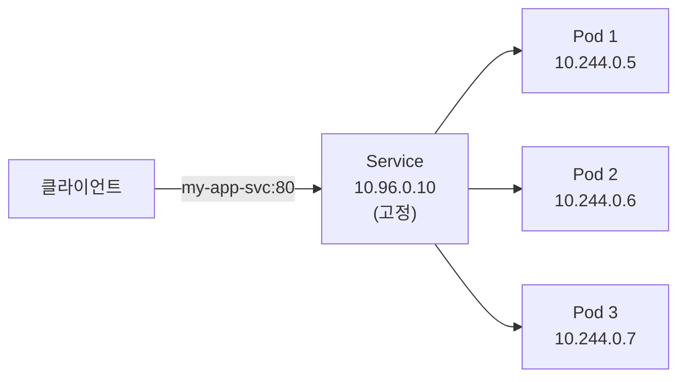
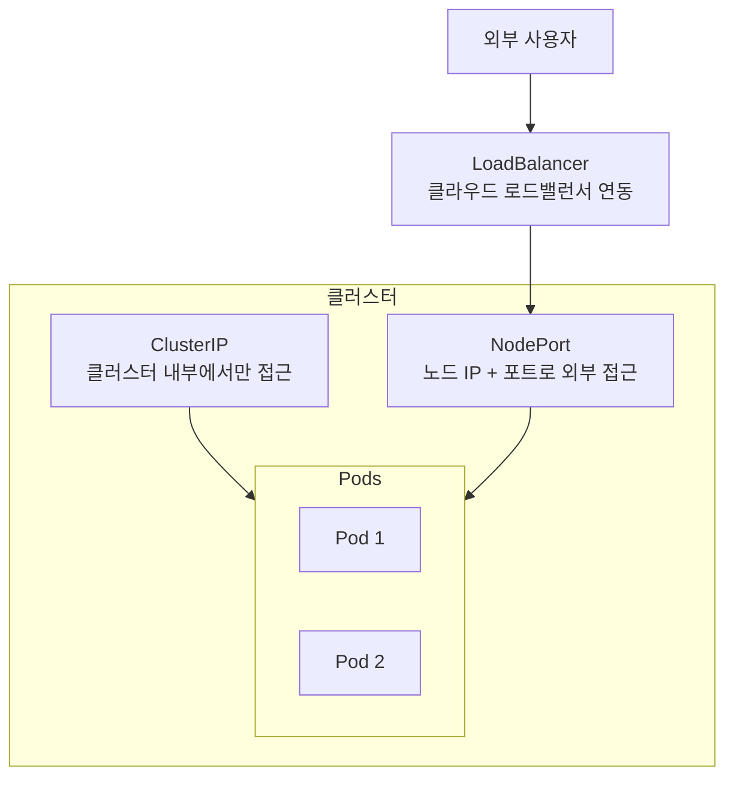
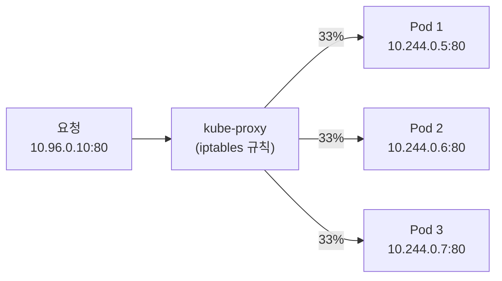



> **Pod 의 IP 를 메모해 뒀는데, 5분 뒤에 달라져 있었습니다.**

3편에서 Deployment 가 Pod 를 자동으로 복구한다는 걸 배웠습니다. 죽은 Pod 를 새로 만들어 주니까 좋은데, 한 가지 문제가 있습니다. 새 Pod 는 **새 IP** 를 받습니다. 프론트엔드가 백엔드 Pod 의 IP 를 직접 알고 있었다면, Pod 가 재시작될 때마다 연결이 끊깁니다.

Docker 시리즈 2편에서 Docker 네트워크를 다뤘을 때, 컨테이너 이름으로 DNS 처럼 서로를 찾는 방법을 배웠습니다. K8s 에서 같은 문제를 풀어주는 것이 **Service** 입니다. Pod 앞에 서서 고정된 주소를 제공하는 안내 데스크 같은 존재입니다.

## Pod IP 는 왜 바뀌는가

먼저 문제를 정확히 짚어 봅니다.

```bash
kubectl get pods -o wide
```

```
NAME                      READY   STATUS    IP           NODE
my-app-6d8f7b4b5c-abc12   1/1     Running   10.244.0.5   minikube
my-app-6d8f7b4b5c-def34   1/1     Running   10.244.0.6   minikube
my-app-6d8f7b4b5c-ghi56   1/1     Running   10.244.0.7   minikube
```

이 Pod 중 하나가 죽으면 Deployment 가 새 Pod 를 만듭니다. 새 Pod 는 `10.244.0.9` 같은 전혀 다른 IP 를 받습니다. Pod IP 는 **임시**입니다 — Pod 의 수명과 함께 태어나고, 함께 사라집니다.

그러면 다른 서비스가 이 Pod 들에 접근하려면 어떻게 해야 할까요? Pod IP 를 직접 쓰면 안 됩니다. 바뀔 테니까요. 여기서 Service 가 등장합니다.

## Service — 고정된 주소를 제공하는 안내 데스크

**Service** 는 Pod 들 앞에 서서 **고정된 IP 와 DNS 이름**을 제공합니다. 클라이언트는 Service 의 주소로 요청을 보내고, Service 가 뒤에 있는 Pod 들에게 트래픽을 분배합니다.



Service 의 IP(`10.96.0.10`)는 Pod 가 죽고 살아도 **바뀌지 않습니다.** 그리고 Service 에 이름을 붙이면 클러스터 내부에서 DNS 로 접근할 수 있습니다.

### Service 가 Pod 를 찾는 방법 — 셀렉터

Service 는 어떤 Pod 에게 트래픽을 보낼지 **라벨 셀렉터**로 결정합니다. 2편에서 배운 라벨과 셀렉터가 여기서도 쓰입니다.

```yaml
# service.yaml
apiVersion: v1
kind: Service
metadata:
  name: my-app-svc
spec:
  selector:
    app: my-app        # 이 라벨을 가진 Pod 에게 트래픽을 보낸다
  ports:
  - port: 80           # Service 가 받는 포트
    targetPort: 80     # Pod 에게 전달하는 포트
```

```bash
kubectl apply -f service.yaml
```

`selector: app: my-app` — 이 Service 는 `app: my-app` 라벨이 붙은 모든 Pod 를 자동으로 찾아서 트래픽을 보냅니다. Pod 가 새로 생기든 죽든, 라벨만 일치하면 Service 가 자동으로 반영합니다.

Docker 의 네트워크에서는 같은 네트워크에 속한 컨테이너끼리 이름으로 통신했습니다. K8s 의 Service 는 그 역할을 하면서, 추가로 **로드밸런싱**과 **서비스 디스커버리**까지 해줍니다.

## Service 의 세 가지 타입

Service 에는 **공개 범위**가 다른 세 가지 타입이 있습니다.



### ClusterIP — 내부 전용 (기본값)

```yaml
spec:
  type: ClusterIP   # 생략해도 기본값
  selector:
    app: my-app
  ports:
  - port: 80
    targetPort: 80
```

- 클러스터 **안에서만** 접근 가능
- 외부에서는 접근 불가
- 마이크로서비스 간 통신에 적합 (프론트엔드 → 백엔드, 백엔드 → DB)
- 가장 많이 쓰이는 타입

```bash
kubectl get svc
```

```
NAME         TYPE        CLUSTER-IP    EXTERNAL-IP   PORT(S)   AGE
my-app-svc   ClusterIP   10.96.0.10    <none>        80/TCP    30s
```

`EXTERNAL-IP` 가 `<none>` — 외부에서는 접근할 수 없습니다.

### NodePort — 노드를 통해 외부에 노출

```yaml
spec:
  type: NodePort
  selector:
    app: my-app
  ports:
  - port: 80
    targetPort: 80
    nodePort: 30080    # 30000~32767 범위
```

- 클러스터의 **모든 노드**에서 지정한 포트(30080)로 접근 가능
- `<노드 IP>:30080` 으로 외부에서 접속
- 포트 범위가 30000~32767 로 제한
- 개발/테스트 환경에서 빠르게 외부 노출할 때 쓰임

```bash
kubectl get svc
```

```
NAME         TYPE       CLUSTER-IP    EXTERNAL-IP   PORT(S)        AGE
my-app-svc   NodePort   10.96.0.10    <none>        80:30080/TCP   30s
```

minikube 에서 접속하려면:

```bash
minikube service my-app-svc
```

이 명령이 브라우저를 열어 줍니다.

### LoadBalancer — 클라우드 로드밸런서 연동

```yaml
spec:
  type: LoadBalancer
  selector:
    app: my-app
  ports:
  - port: 80
    targetPort: 80
```

- 클라우드 환경(AWS, GCP, Azure)에서 **외부 로드밸런서**를 자동 생성
- 로드밸런서의 공인 IP 로 외부 접근 가능
- 운영 환경에서 가장 흔한 외부 노출 방법
- 로컬(minikube)에서는 `EXTERNAL-IP` 가 `<pending>` 으로 남음 — 실제 클라우드 프로바이더가 없으니까

```
NAME         TYPE           CLUSTER-IP    EXTERNAL-IP     PORT(S)        AGE
my-app-svc   LoadBalancer   10.96.0.10    203.0.113.50    80:30080/TCP   30s
```

### 세 가지 타입 비교

| 타입 | 접근 범위 | 사용 시점 | Docker 비유 |
|---|---|---|---|
| **ClusterIP** | 클러스터 내부만 | 서비스 간 통신 | Docker 네트워크 안에서 컨테이너 이름으로 통신 |
| **NodePort** | 노드 IP + 포트 | 개발/테스트 외부 노출 | `docker run -p 30080:80` |
| **LoadBalancer** | 공인 IP | 운영 환경 외부 노출 | (Docker 에는 없음) |

Docker 시리즈 2편에서 `-p` 옵션으로 포트를 열었던 것이 NodePort 와 가장 비슷합니다. LoadBalancer 는 Docker 단독으로는 할 수 없는 — 여러 노드에 걸친 트래픽 분배를 클라우드 인프라와 연동해서 처리합니다.

## 클러스터 내부 DNS — 이름으로 찾는다

ClusterIP Service 를 만들면, K8s 는 자동으로 **DNS 레코드**를 등록합니다.

```
<서비스 이름>.<네임스페이스>.svc.cluster.local
```

예를 들어 `default` 네임스페이스에 `my-app-svc` 라는 Service 가 있으면:

```
my-app-svc.default.svc.cluster.local
```

같은 네임스페이스 안에서는 짧게 **`my-app-svc`** 만으로도 접근 가능합니다.

```bash
# 다른 Pod 에서 테스트
kubectl run test --image=busybox --rm -it -- sh

# Pod 안에서:
wget -qO- http://my-app-svc
# → nginx 환영 페이지 HTML
```

Docker 시리즈 2편에서 같은 네트워크의 컨테이너끼리 이름으로 통신하던 것과 같은 원리입니다. 다만 K8s 에서는 네임스페이스라는 계층이 하나 더 있어서, 다른 네임스페이스의 서비스에 접근하려면 `<서비스명>.<네임스페이스>` 형식을 써야 합니다.

## kube-proxy — Service 뒤에서 일어나는 일

Service 가 트래픽을 Pod 에 전달하는 건 알겠는데, **어떻게** 전달하는 걸까요?

각 워커 노드에는 **kube-proxy** 라는 컴포넌트가 돌고 있습니다. kube-proxy 는 Service 의 IP 로 들어오는 트래픽을 실제 Pod 의 IP 로 **리다이렉트**합니다.



kube-proxy 가 하는 일:

1. Service 가 생기면 iptables(또는 IPVS) 규칙을 노드에 설정
2. Service IP 로 들어오는 패킷을 실제 Pod IP 로 변환
3. Pod 가 추가/제거되면 규칙을 자동 업데이트

사용자가 직접 kube-proxy 를 만질 일은 거의 없습니다. "Service IP 로 보내면 알아서 Pod 로 간다" 를 이해하면 충분합니다.

## 실습 — Deployment + Service 한 세트

실제로는 Deployment 와 Service 를 함께 배포합니다. 하나의 파일에 둘 다 넣을 수 있습니다:

```yaml
# app.yaml
apiVersion: apps/v1
kind: Deployment
metadata:
  name: web
spec:
  replicas: 3
  selector:
    matchLabels:
      app: web
  template:
    metadata:
      labels:
        app: web
    spec:
      containers:
      - name: nginx
        image: nginx:1.27
        ports:
        - containerPort: 80
---
apiVersion: v1
kind: Service
metadata:
  name: web-svc
spec:
  type: NodePort
  selector:
    app: web
  ports:
  - port: 80
    targetPort: 80
    nodePort: 30080
```

YAML 파일 안에서 `---` 로 여러 리소스를 구분합니다. Docker Compose 에서 하나의 `docker-compose.yml` 에 여러 서비스를 정의하던 것과 비슷합니다.

```bash
kubectl apply -f app.yaml

# Deployment 확인
kubectl get deployments

# Pod 확인
kubectl get pods

# Service 확인
kubectl get svc

# minikube 에서 접속
minikube service web-svc
```

이 한 세트가 K8s 에서 앱을 배포하는 가장 기본적인 패턴입니다: **Deployment 로 Pod 를 관리하고, Service 로 접근 경로를 만든다.**

## 함정 — 자주 하는 실수

**1. Service 의 selector 를 빠뜨리면?**

```yaml
spec:
  # selector 없음!
  ports:
  - port: 80
```

Service 는 만들어지지만, 트래픽을 보낼 Pod 가 없습니다. `kubectl describe svc` 로 확인하면 `Endpoints: <none>` 이 나옵니다.

**2. port 와 targetPort 혼동**

```yaml
ports:
- port: 80         # Service 가 받는 포트 (클라이언트가 쓰는 포트)
  targetPort: 8080  # Pod 가 실제로 듣고 있는 포트
```

둘이 다를 수 있습니다. 앱이 8080 에서 돌고 있다면 `targetPort: 8080` 이어야 합니다. `port: 80` 은 Service 가 외부에 노출하는 포트입니다.

**3. 다른 네임스페이스의 Service 에 접근할 때**

같은 네임스페이스면 `my-app-svc` 만으로 되지만, 다른 네임스페이스면 `my-app-svc.other-namespace` 로 네임스페이스를 명시해야 합니다. 이걸 빠뜨리면 DNS 해석이 안 됩니다.

## 가져갈 한 줄

> **Pod IP 는 임시이고, Service IP 는 고정이다 — 항상 Service 를 통해 접근해라.**

Docker 에서 컨테이너 이름으로 통신하던 것의 K8s 버전이 Service 입니다. 다만 K8s 의 Service 는 로드밸런싱, DNS 등록, 외부 노출까지 함께 다룹니다. Deployment + Service 한 세트가 K8s 배포의 기본 단위라는 것만 기억하면 됩니다.

다음 편에서는 앱의 **설정과 비밀**을 어떻게 관리하는지를 다룹니다. 환경 변수를 이미지에 하드코딩하지 않고, **ConfigMap** 과 **Secret** 으로 분리하는 방법.

---

## 참고

- [Kubernetes 공식 문서 — Service](https://kubernetes.io/docs/concepts/services-networking/service/)
- [Kubernetes 공식 문서 — DNS for Services and Pods](https://kubernetes.io/docs/concepts/services-networking/dns-pod-service/)
- [Docker 시리즈 2편 — Docker 네트워크](/posts/docker-network/)
- [Kubernetes 시리즈 3편 — Deployment 와 ReplicaSet](/posts/k8s-deployment/)
