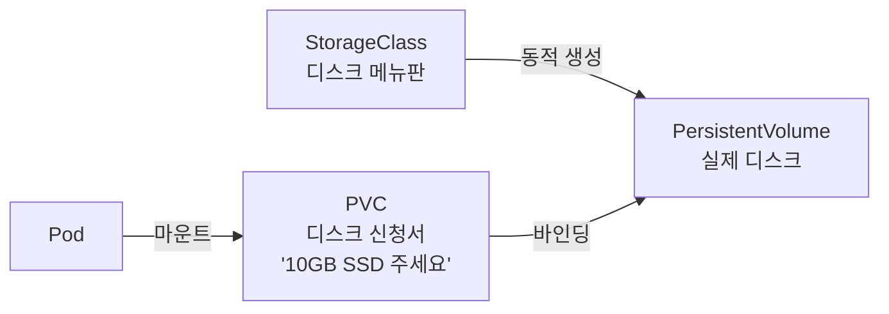
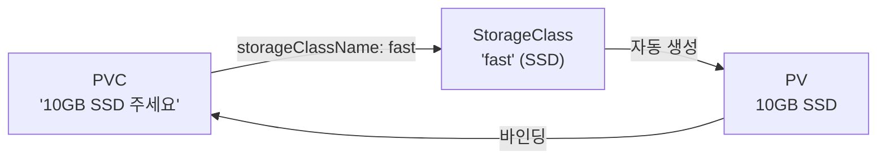



> **DB 컨테이너를 재시작했더니 데이터가 전부 날아갔습니다 — Docker 4편에서도 똑같은 사고를 겪었습니다.**

Docker 시리즈 4편에서 이 문제를 다뤘습니다. 컨테이너는 기본적으로 **임시** 저장소를 씁니다. 컨테이너가 죽으면 안에 쌓인 데이터도 같이 사라집니다. Docker 에서는 `-v` 옵션으로 호스트 디렉토리를 마운트하거나 named volume 을 만들어서 해결했습니다.

K8s 에서도 같은 문제가 있고, 해법도 비슷하지만 한 층 더 복잡합니다. 서버가 한 대가 아니라 여러 대이기 때문입니다. Pod 가 노드 A 에서 죽고 노드 B 에서 다시 뜨면, 노드 A 에 있던 데이터를 어떻게 가져올까요? 이 문제를 풀기 위해 K8s 는 **PersistentVolume(PV)**, **PersistentVolumeClaim(PVC)**, **StorageClass** 라는 세 가지 개념을 도입합니다.

## K8s 의 볼륨 — Docker 볼륨과 뭐가 다른가

Docker 의 볼륨은 단순합니다:

```bash
docker run -v my-data:/var/lib/postgresql/data postgres
```

호스트의 `my-data` 볼륨이 컨테이너의 `/var/lib/postgresql/data` 에 마운트되고, 컨테이너가 죽어도 데이터는 호스트에 남습니다. 간단하고 직관적입니다.

K8s 에서는 왜 이렇게 간단하지 않을까요?

| | Docker 볼륨 | K8s 볼륨 |
|---|---|---|
| **서버** | 한 대 | 여러 대 (클러스터) |
| **Pod 이동** | 해당 없음 | 노드 A → 노드 B 로 이동 가능 |
| **디스크 종류** | 호스트 로컬 디스크 | 로컬 디스크, 클라우드 디스크 (EBS, GCE PD), NFS 등 다양 |
| **생명주기** | 호스트에 종속 | Pod 와 독립적으로 존재 가능 |

서버가 여러 대이면, "이 디스크가 어느 노드에 있는가", "Pod 가 다른 노드로 옮겨가면 디스크도 따라가는가" 같은 문제가 생깁니다. 이걸 체계적으로 관리하기 위해 K8s 는 **스토리지를 추상화**합니다.

## 세 가지 개념 — PV, PVC, StorageClass



### PersistentVolume (PV) — 실제 디스크

**PV** 는 클러스터에 연결된 **실제 스토리지**를 나타내는 리소스입니다. 노드의 로컬 디스크일 수도 있고, AWS EBS, GCE Persistent Disk, NFS 서버일 수도 있습니다.

비유하면 **창고에 있는 실제 저장 공간**입니다.

```yaml
apiVersion: v1
kind: PersistentVolume
metadata:
  name: my-pv
spec:
  capacity:
    storage: 10Gi
  accessModes:
  - ReadWriteOnce
  hostPath:
    path: /data/my-pv    # 노드의 로컬 경로 (테스트용)
```

| 필드 | 의미 |
|---|---|
| `capacity.storage` | 저장 공간 크기 |
| `accessModes` | 접근 방식 |
| `hostPath` | 노드 로컬 디스크 경로 (테스트용, 운영에서는 비추) |

`accessModes` 종류:

| 모드 | 의미 |
|---|---|
| `ReadWriteOnce` (RWO) | 하나의 노드에서 읽기/쓰기 |
| `ReadOnlyMany` (ROX) | 여러 노드에서 읽기 전용 |
| `ReadWriteMany` (RWX) | 여러 노드에서 읽기/쓰기 (NFS 등 필요) |

### PersistentVolumeClaim (PVC) — 디스크 신청서

**PVC** 는 "이런 스토리지가 필요합니다" 라는 **요청서**입니다. 사용자(또는 Pod)는 PV 를 직접 지정하지 않고, "10GB 짜리 ReadWriteOnce 디스크가 필요해" 라고 PVC 로 신청합니다.

비유하면 **"저장 공간 10GB 주세요" 라는 신청서**입니다.

```yaml
apiVersion: v1
kind: PersistentVolumeClaim
metadata:
  name: my-pvc
spec:
  accessModes:
  - ReadWriteOnce
  resources:
    requests:
      storage: 10Gi
```

PVC 를 만들면 K8s 가 조건에 맞는 PV 를 찾아서 **바인딩**합니다. PV 의 크기와 accessMode 가 PVC 의 요청과 일치하면 연결됩니다.

```bash
kubectl get pvc
```

```
NAME     STATUS   VOLUME   CAPACITY   ACCESS MODES   AGE
my-pvc   Bound    my-pv    10Gi       RWO            10s
```

`STATUS: Bound` — PVC 가 PV 에 성공적으로 연결되었다는 뜻입니다.

### 왜 PV 와 PVC 를 분리하나?

이 구조가 처음엔 번거로워 보이지만, 이유가 있습니다:

- **역할 분리** — 인프라 관리자가 PV(실제 디스크)를 준비하고, 개발자는 PVC(얼마나 필요한지)만 적으면 된다
- **이식성** — Pod 매니페스트에 "AWS EBS" 같은 구체적인 스토리지 이름을 넣지 않아도 된다. PVC 만 참조하면 환경이 바뀌어도 Pod YAML 은 그대로
- **재사용** — PV 는 Pod 와 독립적으로 존재. Pod 가 삭제되어도 PV 의 데이터는 남는다

### Pod 에서 PVC 사용

```yaml
apiVersion: v1
kind: Pod
metadata:
  name: my-db
spec:
  containers:
  - name: postgres
    image: postgres:16
    volumeMounts:
    - name: db-storage
      mountPath: /var/lib/postgresql/data
  volumes:
  - name: db-storage
    persistentVolumeClaim:
      claimName: my-pvc     # PVC 이름 참조
```

5편에서 ConfigMap 을 볼륨으로 마운트했던 것과 구조가 같습니다. `volumes` 에서 PVC 를 참조하고, `volumeMounts` 에서 컨테이너 안의 경로를 지정합니다.

Docker 의 `-v my-data:/var/lib/postgresql/data` 와 같은 결과이지만, K8s 에서는 PVC → PV 라는 중간 단계가 있어서 스토리지의 종류와 위치를 추상화합니다.

## StorageClass — 동적으로 디스크를 만들어 주는 메뉴판

PV 를 미리 만들어 두고 PVC 가 찾아가는 방식을 **정적 프로비저닝**이라고 합니다. 하지만 매번 관리자가 PV 를 수동으로 만들어야 한다면 번거롭습니다.

**StorageClass** 는 "이런 종류의 디스크를 자동으로 만들어줘" 라는 **메뉴판**입니다. PVC 가 생기면 StorageClass 가 **PV 를 자동으로 생성**합니다. 이걸 **동적 프로비저닝**이라고 부릅니다.



```yaml
# StorageClass 예시 (AWS EBS)
apiVersion: storage.k8s.io/v1
kind: StorageClass
metadata:
  name: fast
provisioner: ebs.csi.aws.com
parameters:
  type: gp3
```

PVC 에서 StorageClass 를 지정합니다:

```yaml
apiVersion: v1
kind: PersistentVolumeClaim
metadata:
  name: my-pvc
spec:
  storageClassName: fast    # 이 StorageClass 를 사용
  accessModes:
  - ReadWriteOnce
  resources:
    requests:
      storage: 10Gi
```

이제 PV 를 미리 만들 필요가 없습니다. PVC 를 만들면 StorageClass 가 알아서 PV 를 생성하고 바인딩합니다.

minikube 에서는 `standard` 라는 기본 StorageClass 가 이미 있습니다:

```bash
kubectl get storageclass
```

```
NAME                 PROVISIONER                RECLAIMPOLICY   AGE
standard (default)   k8s.io/minikube-hostpath   Delete          1h
```

`storageClassName` 을 지정하지 않으면 이 default StorageClass 가 사용됩니다.

## 정적 vs 동적 프로비저닝 비교

| | 정적 프로비저닝 | 동적 프로비저닝 |
|---|---|---|
| **PV 생성** | 관리자가 수동으로 미리 만듦 | StorageClass 가 자동 생성 |
| **StorageClass** | 불필요 | 필요 |
| **적합한 경우** | 기존 디스크를 그대로 쓸 때 | 클라우드 환경에서 필요할 때마다 생성 |
| **실무** | 특수한 경우 | 대부분 이 방식 |

운영에서는 거의 항상 동적 프로비저닝을 씁니다. 관리자가 StorageClass 를 한 번 정의해 두면, 개발자는 PVC 만 만들면 됩니다.

## 데이터의 생명주기 — PV 가 삭제되면?

PVC 를 삭제하면 연결된 PV 는 어떻게 될까요? 이건 **Reclaim Policy** 로 결정됩니다.

| 정책 | 동작 |
|---|---|
| **Retain** | PV 와 데이터를 보존. 관리자가 수동으로 정리 |
| **Delete** | PV 와 실제 스토리지(클라우드 디스크 등)를 함께 삭제 |

StorageClass 의 `reclaimPolicy` 에서 설정합니다. 기본값은 보통 `Delete` 입니다.

**주의:** `Delete` 정책이면 PVC 를 삭제하는 순간 데이터가 사라집니다. 운영 DB 의 PVC 를 실수로 삭제하면 데이터가 날아갈 수 있으니, 중요한 데이터는 `Retain` 정책을 쓰는 것이 안전합니다.

## 실습 — PostgreSQL 에 영속 볼륨 붙이기

PVC + Deployment 를 조합한 실전 예제입니다:

```yaml
# postgres.yaml
apiVersion: v1
kind: PersistentVolumeClaim
metadata:
  name: postgres-pvc
spec:
  accessModes:
  - ReadWriteOnce
  resources:
    requests:
      storage: 1Gi
---
apiVersion: apps/v1
kind: Deployment
metadata:
  name: postgres
spec:
  replicas: 1
  selector:
    matchLabels:
      app: postgres
  template:
    metadata:
      labels:
        app: postgres
    spec:
      containers:
      - name: postgres
        image: postgres:16
        env:
        - name: POSTGRES_PASSWORD
          value: "mysecretpw"        # 실무에서는 Secret 으로!
        ports:
        - containerPort: 5432
        volumeMounts:
        - name: postgres-data
          mountPath: /var/lib/postgresql/data
      volumes:
      - name: postgres-data
        persistentVolumeClaim:
          claimName: postgres-pvc
---
apiVersion: v1
kind: Service
metadata:
  name: postgres-svc
spec:
  selector:
    app: postgres
  ports:
  - port: 5432
    targetPort: 5432
```

```bash
kubectl apply -f postgres.yaml
```

이 한 파일에 PVC, Deployment, Service 가 모두 들어 있습니다. 지금까지 배운 3편(Deployment), 4편(Service), 5편(환경변수), 6편(Volume)이 전부 합쳐진 형태입니다.

이제 Pod 를 삭제해도 데이터가 남는지 확인할 수 있습니다:

```bash
# DB 에 데이터 넣기
kubectl exec -it deploy/postgres -- psql -U postgres -c "CREATE TABLE test (id int);"

# Pod 강제 삭제
kubectl delete pod -l app=postgres

# Deployment 가 새 Pod 를 만든 뒤 확인
kubectl exec -it deploy/postgres -- psql -U postgres -c "SELECT * FROM test;"
# → 테이블이 살아 있다!
```

Docker 시리즈 4편에서 `docker run -v` 로 했던 것과 같은 결과입니다. 다만 K8s 에서는 PVC 라는 추상화 계층이 있어서, 스토리지가 로컬 디스크든 클라우드 디스크든 Pod 입장에서는 신경 쓸 필요가 없습니다.

## 함정 — 자주 하는 실수

**1. hostPath 를 운영에서 쓰면 안 된다**

```yaml
hostPath:
  path: /data/my-app
```

`hostPath` 는 특정 노드의 로컬 디스크를 직접 마운트합니다. Pod 가 다른 노드로 이동하면 데이터가 없습니다. 테스트·학습용으로만 쓰고, 운영에서는 클라우드 디스크나 NFS 를 사용해야 합니다.

**2. PVC 없이 Pod 의 볼륨만 쓰면?**

```yaml
volumes:
- name: temp
  emptyDir: {}
```

`emptyDir` 은 Pod 가 살아 있는 동안만 존재하는 임시 볼륨입니다. Pod 가 삭제되면 데이터도 사라집니다. 캐시나 임시 파일에는 쓸 수 있지만, 영속 데이터에는 반드시 PVC 를 써야 합니다.

**3. DB 에 replicas: 3 을 쓰면?**

Deployment 로 DB 를 여러 개 띄우면, 각 Pod 가 같은 PVC 를 마운트하려고 합니다. `ReadWriteOnce` 모드에서는 하나의 노드에서만 마운트 가능하므로, 두 번째 Pod 부터 스케줄링이 실패합니다. DB 처럼 상태가 있는 앱은 Deployment 대신 **StatefulSet** 이라는 별도 리소스를 쓰는 것이 일반적입니다 — 이건 이 시리즈의 범위를 넘으므로 이름만 알아 두면 됩니다.

## 가져갈 한 줄

> **Docker 의 `-v` 가 K8s 에서는 PVC 가 된다 — 디스크의 종류와 위치를 추상화해서, Pod 는 "얼마나 필요한지" 만 말하면 된다.**

PV 는 실제 디스크, PVC 는 신청서, StorageClass 는 자동 생성 메뉴판. 이 세 개의 관계만 잡으면 K8s 스토리지의 큰 그림은 끝입니다.

다음 편은 시리즈의 마지막입니다. 외부 트래픽을 도메인과 경로로 라우팅하는 **Ingress**, 그리고 점점 늘어나는 매니페스트를 패키징하는 **Helm** 을 다룹니다.

---

## 참고

- [Kubernetes 공식 문서 — Persistent Volumes](https://kubernetes.io/docs/concepts/storage/persistent-volumes/)
- [Kubernetes 공식 문서 — Storage Classes](https://kubernetes.io/docs/concepts/storage/storage-classes/)
- [Docker 시리즈 4편 — Docker 볼륨과 데이터 영속화](/posts/docker-volume/)
