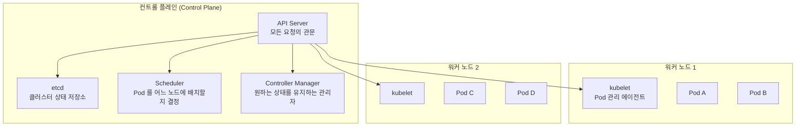



> **`docker run` 하나로 시작한 서비스가, 30분 뒤엔 손이 모자랐습니다.**

컨테이너가 죽으면 사람이 다시 띄우고, 서버가 두 대로 늘면 SSH 두 번 들어가고, 무중단 배포는 *그냥 새벽에* 하던 그날의 이야기입니다. Docker 시리즈 5편을 통해 컨테이너 하나를 빌드하고, 네트워크를 잇고, Compose 로 묶고, 볼륨으로 데이터를 살리고, Dockerfile 을 다듬는 데까지 왔습니다. 그런데 실제 운영에 올리는 순간, Docker 혼자서는 풀 수 없는 문제가 쏟아집니다.

이 글은 그 문제가 무엇인지, 그리고 Kubernetes 가 어떤 구조로 해결하는지를 정리하는 시리즈의 1편입니다.

## docker run 으로 30분 만에 무너지는 시나리오

웹 서비스를 하나 올린다고 합시다. 처음엔 간단합니다.

```bash
docker run -d -p 80:8080 --name my-app my-app:1.0
```

잘 됩니다. 그런데 30분 뒤부터 일이 시작됩니다.

**1단계 — 컨테이너가 죽는다.**
OOM(메모리 초과) 이든 에러든, 컨테이너는 죽습니다. `--restart=always` 를 붙이면 단일 호스트 안에서는 자동 재시작이 됩니다. 하지만 서버 자체가 죽으면? 컨테이너와 함께 사라집니다.

**2단계 — 트래픽이 늘어난다.**
한 대로는 감당이 안 됩니다. 서버를 한 대 더 추가합니다. SSH 로 접속해서 같은 `docker run` 명령을 한 번 더 칩니다. 로드밸런서도 직접 달아야 합니다. 서버가 세 대, 네 대로 늘면? 같은 작업을 매번 반복합니다.

**3단계 — 새 버전을 배포해야 한다.**
`my-app:2.0` 이 나왔습니다. 서버 네 대에 걸쳐 있는 컨테이너를 한 대씩 멈추고, 새 이미지로 교체하고, 혹시 문제가 생기면 다시 롤백해야 합니다. 새벽 2시에, 수동으로.

**4단계 — 설정이 다 다르다.**
서버마다 환경 변수가 다르고, 볼륨 경로가 다르고, 어디는 v1.0 이 아직 돌고 있습니다. 어느 서버에 뭐가 올라가 있는지 파악하려면 한 대씩 들어가서 `docker ps` 를 쳐봐야 합니다.

정리하면, `docker run` 의 한계는 이 네 가지입니다.

| 문제 | docker run 의 현실 |
|---|---|
| **장애 복구** | 같은 호스트 내 재시작은 되지만, 호스트가 죽으면 끝 |
| **스케일링** | 서버마다 SSH 접속해서 수동으로 컨테이너를 띄움 |
| **무중단 배포** | 한 대씩 멈추고 새 이미지로 교체, 롤백도 수동 |
| **상태 파악** | 어느 서버에 어떤 버전이 도는지 사람이 직접 확인 |

이 문제들의 공통점은 하나입니다 — **사람이 컨테이너를 관리**하고 있다는 것. 컨테이너가 열 개 넘어가는 순간, 사람의 손은 부족합니다.

## 오케스트레이션이란

이 문제를 풀기 위해 등장한 개념이 **컨테이너 오케스트레이션**입니다. 오케스트라의 지휘자가 연주자들에게 "언제 시작하고, 언제 멈추고, 몇 명이 연주할지" 를 지시하듯, 오케스트레이터는 컨테이너들에게 같은 일을 합니다.

오케스트레이션이 해주는 것:

- **자동 복구(Self-healing)** — 컨테이너가 죽으면, 사람이 아니라 시스템이 자동으로 다시 띄운다.
- **자동 스케일링** — "이 앱은 항상 3개가 돌아야 한다" 고 선언하면, 시스템이 3개를 유지한다.
- **무중단 배포(Rolling Update)** — 새 버전을 하나씩 올리면서 기존 버전을 하나씩 내린다. 사용자는 중단을 느끼지 못한다.
- **노드 분산** — 여러 서버(노드) 에 컨테이너를 자동으로 분배한다. 어떤 서버에 여유가 있는지 사람이 신경 쓸 필요가 없다.

핵심은 **명령형(imperative)** 에서 **선언형(declarative)** 으로의 전환입니다.

- 명령형: "서버 A 에 접속해서, 컨테이너를 멈추고, 새 이미지를 받아서, 다시 시작해."
- 선언형: "이 앱은 3개 복제본이 v2.0 으로 돌아야 한다." → 시스템이 현재 상태와 비교해서 알아서 맞춘다.

Docker Compose 를 써봤다면 약간 감이 올 수 있습니다. `docker-compose.yml` 에 서비스를 정의하면 `docker compose up` 한 번으로 전체가 뜨니까요. 하지만 Compose 는 **단일 호스트** 도구입니다. 서버가 여러 대로 늘어나는 순간 Compose 혼자서는 해결이 안 됩니다. Kubernetes 는 이걸 **여러 호스트에 걸쳐** 해주는 도구입니다.

## Kubernetes 란 — 큰 그림 먼저

Kubernetes(K8s) 는 **컨테이너 오케스트레이션 플랫폼**입니다. 이름이 길어서 보통 **K8s** 라고 줄여 씁니다 — `K` 와 `s` 사이에 8글자가 있다는 뜻입니다.

Google 이 내부에서 10년 넘게 사용하던 컨테이너 관리 시스템(Borg) 의 경험을 바탕으로, 2014년에 오픈소스로 공개했습니다. 지금은 CNCF(Cloud Native Computing Foundation) 가 관리하고, 사실상 컨테이너 오케스트레이션의 표준입니다.

K8s 의 핵심 구조는 크게 두 영역으로 나뉩니다.



### 클러스터

**클러스터(Cluster)** 는 K8s 가 관리하는 서버 묶음 전체를 가리킵니다. 컨트롤 플레인과 워커 노드를 합쳐서 하나의 클러스터라고 부릅니다. "K8s 를 쓴다" 는 말은 곧 "클러스터를 운영한다" 는 뜻입니다.

### 컨트롤 플레인 — 지휘소

컨트롤 플레인은 클러스터 전체를 관리하는 **두뇌**입니다. 실제로 컨테이너가 돌아가는 곳은 아닙니다. 대신 "어떤 컨테이너가 어디서 몇 개 돌아야 하는지" 를 결정하고 감시합니다.

구성 요소를 하나씩 보면:

| 구성 요소 | 역할 | 비유 |
|---|---|---|
| **API Server** | 모든 요청이 거치는 관문. `kubectl` 명령도 여기로 간다 | 안내 데스크 |
| **etcd** | 클러스터의 모든 상태를 저장하는 key-value 저장소 | 장부 |
| **Scheduler** | 새로 생긴 Pod 를 어느 노드에 배치할지 결정 | 자리 배치표 담당자 |
| **Controller Manager** | "원하는 상태" 와 "현재 상태" 를 비교해서 차이를 메운다 | 현장 감독 |

이 넷이 한 팀으로 움직이면서 *"내가 원한 상태"* 를 끊임없이 유지합니다.

### 워커 노드 — 일꾼

워커 노드는 **실제로 컨테이너가 돌아가는 서버**입니다. 각 워커 노드에는 **kubelet** 이라는 에이전트가 설치되어 있어서, 컨트롤 플레인의 지시를 받아 컨테이너를 띄우고, 상태를 보고합니다.

워커 노드가 하는 일:

- 컨트롤 플레인이 "Pod 를 띄워라" 라고 지시하면 kubelet 이 컨테이너를 실행
- 컨테이너의 건강 상태를 주기적으로 보고
- 노드 자체의 리소스(CPU, 메모리) 현황을 보고

워커 노드가 죽으면? 컨트롤 플레인이 감지하고, 그 노드에서 돌던 컨테이너를 **다른 살아 있는 노드로 자동 이동**시킵니다. 이게 `docker run --restart=always` 와의 결정적 차이입니다.

## 선언형 관리 — "원하는 상태를 적어라"

K8s 를 이해하는 데 가장 중요한 개념 하나를 꼽으면 **Desired State(원하는 상태)** 입니다.

사용자는 "이렇게 되어야 한다" 라는 상태를 YAML 파일로 적어서 K8s 에 제출합니다. 이 YAML 파일을 **매니페스트(manifest)** 라고 부릅니다. K8s 는 현재 상태를 원하는 상태에 끊임없이 맞춥니다.

```yaml
# 매니페스트 예시 — "my-app 을 3개 띄워라"
apiVersion: apps/v1
kind: Deployment
metadata:
  name: my-app
spec:
  replicas: 3
  selector:
    matchLabels:
      app: my-app
  template:
    metadata:
      labels:
        app: my-app
    spec:
      containers:
      - name: my-app
        image: my-app:2.0
        ports:
        - containerPort: 8080
```

아직 각 필드의 의미를 외울 필요는 없습니다. 지금 잡을 핵심은 이것입니다:

> **"이 앱은 3개가 돌아야 하고, 이미지는 2.0 이다"** 라고 적으면, K8s 가 현재 상태와 비교해서 부족하면 더 만들고 초과하면 줄입니다.

이 매니페스트를 K8s 에 전달하는 도구가 **kubectl**(큐브 컨트롤, 또는 큐브 시티엘) 입니다.

```bash
kubectl apply -f deployment.yaml
```

이 한 줄로 끝입니다. SSH 접속도, 서버 지정도 필요 없습니다. 어느 노드에 배치할지는 Scheduler 가 알아서 결정합니다.

## docker run 의 한계가 K8s 에서 어떻게 풀리는가

앞에서 정리한 네 가지 문제를 K8s 의 해법과 나란히 놓으면:

| 문제 | docker run | Kubernetes |
|---|---|---|
| **장애 복구** | 같은 호스트 내 재시작만 가능 | 노드가 죽어도 다른 노드에서 자동 재생성 |
| **스케일링** | 서버마다 수동으로 컨테이너 추가 | `replicas: 5` 로 숫자만 바꾸면 자동 확장 |
| **무중단 배포** | 수동으로 한 대씩 교체, 롤백도 수동 | 롤링 업데이트 기본 제공, `kubectl rollout undo` 로 롤백 |
| **상태 파악** | 서버마다 SSH 접속해서 확인 | `kubectl get pods` 한 줄로 전체 현황 확인 |

Docker Compose 와도 비교해 둡니다:

| | Docker Compose | Kubernetes |
|---|---|---|
| **범위** | 단일 호스트 | 여러 호스트(클러스터) |
| **장애 복구** | 컨테이너 재시작만 | 노드 장애까지 대응 |
| **스케일링** | `scale` 지원하지만 같은 서버 안에서만 | 노드를 넘어 분산 |
| **배포 전략** | 없음 (전부 내리고 다시 올림) | 롤링 업데이트, 블루-그린, 카나리 |
| **적합한 용도** | 로컬 개발, 소규모 단일 서버 | 운영 환경, 멀티 노드 |

Compose 가 나쁜 도구라는 뜻이 아닙니다. 로컬 개발에서는 여전히 Compose 가 더 간편합니다. 다만 "서버 여러 대에 걸쳐 컨테이너를 관리해야 할 때" 부터는 K8s 의 영역입니다.

## 함정 — 흔한 오해 세 가지

**1. "K8s 가 Docker 를 대체한다?"**
아닙니다. K8s 는 컨테이너를 **관리**하는 도구이고, Docker 는 컨테이너를 **만드는** 도구입니다. 둘은 계층이 다릅니다. 이미지를 빌드하는 건 여전히 Docker(또는 다른 빌드 도구) 의 몫이고, K8s 는 그 이미지를 받아서 여러 서버에 걸쳐 실행하고 관리하는 역할입니다.

> 참고: K8s 1.24 부터 컨테이너 런타임으로 Docker 를 직접 쓰지 않고 containerd 를 씁니다. 하지만 이건 "K8s 내부에서 컨테이너를 실행하는 엔진"의 교체이지, Docker 로 빌드한 이미지가 안 돌아간다는 뜻이 아닙니다. `docker build` 로 만든 이미지는 OCI 표준을 따르므로 K8s 에서 그대로 사용 가능합니다.

**2. "작은 서비스에도 K8s 가 필요한가?"**
서버 한 대, 컨테이너 두세 개라면 Compose 로 충분합니다. K8s 는 클러스터를 구성하고 운영하는 것 자체에 비용(학습, 리소스, 관리)이 들기 때문에, 규모가 작으면 오히려 과한 도구입니다. "K8s 가 좋다" 가 아니라 "이 규모에서 K8s 가 필요한가" 를 먼저 묻는 게 맞습니다.

**3. "YAML 을 많이 써야 해서 복잡하다?"**
맞습니다 — 그런데 그게 단점만은 아닙니다. 매니페스트가 YAML 로 존재한다는 건 **인프라 상태가 코드로 버전 관리된다**는 뜻입니다. git 에 올려두면 누가, 언제, 무엇을 바꿨는지 추적할 수 있고, PR 리뷰도 됩니다. YAML 이 많아지는 문제는 시리즈 후반부에서 Helm 으로 다루게 됩니다.

## 가져갈 한 줄

> **K8s 는 "이 상태를 유지해줘" 라고 적으면 나머지를 알아서 하는 시스템이다.**

`docker run` 이 "이 컨테이너를 지금 띄워" 라는 **명령**이라면, K8s 의 매니페스트는 "이 앱은 이렇게 돌아야 한다" 라는 **선언**입니다. 그 차이 하나가, 서버가 늘어나도 사람의 손이 늘어나지 않게 만들어 줍니다.

다음 편에서는 K8s 의 가장 작은 실행 단위인 **Pod** 를 다룹니다. 로컬에 클러스터를 하나 띄우고, 첫 Pod 를 만들어 보겠습니다.

---

## 참고

- [Kubernetes 공식 문서 — What is Kubernetes?](https://kubernetes.io/docs/concepts/overview/what-is-kubernetes/)
- [Kubernetes 공식 문서 — Components](https://kubernetes.io/docs/concepts/overview/components/)
- [Docker 시리즈 1편 — Docker 기초](/posts/docker-basics/)
- [Docker 시리즈 3편 — Docker Compose](/posts/docker-compose/)
