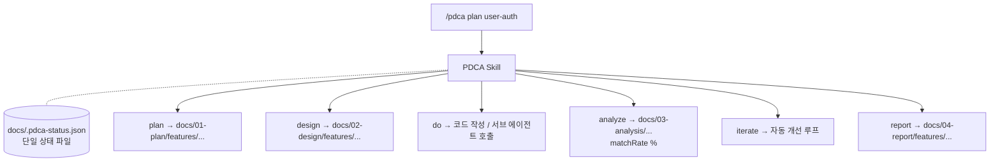
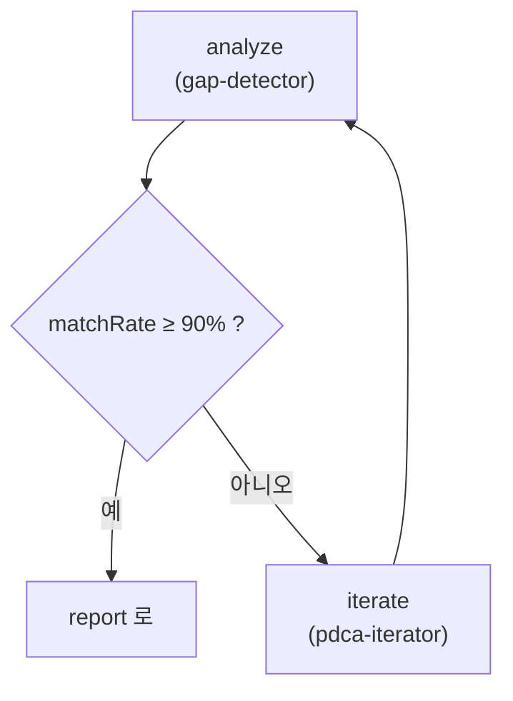

> "어제 어디까지 했지?"

AI 페어 프로그래밍을 며칠만 해본 사람이라면 한 번쯤 떠올리는 질문입니다. 모델은 어제의 결정을 기억하지 못하고, 사람은 매번 처음부터 설명을 다시 깔아야 합니다. 단발 작업이라면 그래도 됩니다. **여러 사이클을 쌓아 가는 실제 제품 개발**에서는, 이 휘발성이 가장 비싼 비용이 됩니다.

Claude Code 의 PDCA Skill 은 이 문제를 정면으로 다룹니다. 이번 글은 스킬의 안쪽을 뜯어보면서, "AI 에게 절차를 강제한다" 는 발상이 어떻게 코드로 구현되어 있는지 정리한 기록입니다.

## 매번 처음부터 다시 설명한다

전형적인 풍경 한 장.

```
[월요일]   요구사항을 설명한다 → 설계가 나온다 → 구현한다
[화요일]   "어제 어디까지 했지?"
[화요일]   요구사항을 다시 설명한다 → 설계가 또 나온다
```

기억이 없으니 절차도 없습니다. 어제의 결정이 오늘로 이어지지 않고, "설계대로 짰는가?" 를 객관적으로 확인할 방법도 없습니다.

## "스킬" 이라는 단위

먼저 그림 한 장.



`/pdca <action> <feature>` 하나의 진입점이 모든 단계를 라우팅합니다. 핵심은 **상태가 파일 하나로 외화**된다는 점입니다. `docs/.pdca-status.json` 이 "지금 어디까지 와 있는가" 를 갖고 있고, 모든 액션이 이걸 읽고 갱신합니다. 다음 세션이 어제의 자리에서 시작할 수 있는 이유입니다.

## 6단계, 그리고 후처리

PDCA 라는 이름이지만 실제 단계는 6개입니다.

| 단계 | 액션 | 산출물 |
|---|---|---|
| Plan | `/pdca plan` | 요구사항·범위 문서 |
| Design | `/pdca design` | API·데이터 모델 설계 |
| Do | `/pdca do` | 실제 코드 |
| Check | `/pdca analyze` | 설계 vs 구현 갭 분석 |
| Act | `/pdca iterate` | 자동 개선 반복 |
| Report | `/pdca report` | 사이클 보고서 |

여기에 `archive`, `cleanup`, `commit` 같은 **후처리까지** 액션으로 만들어 둔 게 인상적입니다. 끝난 피처를 `docs/archive/YYYY-MM/` 로 자동 이동하고 commit 메시지 형식까지 표준화합니다. "끝낸 뒤 정리" 가 제일 자주 누락되는 단계인 걸 알고 만든 거죠.

## 더 재미있는 건 안쪽이다

겉으로 보이는 액션 표보다, **안쪽 설계** 가 훨씬 흥미롭습니다.

### 1. SKILL.md 는 라우팅, 절차는 Ref 분리

```
pdca/
├── SKILL.md                   # ← 라우팅 표만
├── refs/
│   └── actions/
│       ├── plan.ref.md        # ← 절차 본문
│       ├── design.ref.md
│       └── ...
└── templates/                 # ← 산출물 템플릿
```

본체에는 "어떤 액션이면 어느 ref 를 읽어라" 라는 표만 두고, 실제 절차는 ref 파일로 분리됩니다. **호출된 액션의 ref 만 컨텍스트에 들어오니** 토큰이 비대해지지 않습니다. 캐시된 ref 가 잘리지 않았으면 Read 도 생략한다는 작은 규칙까지 들어가 있습니다.

### 2. 서브 에이전트 분업

`do` 단계는 그냥 코드를 쓰지 않습니다. **전문 서브 에이전트로 라우팅**합니다.

```
do
├── backend-designer  → backend-developer
└── frontend-designer → frontend-developer
```

설계 담당과 구현 담당이 분리돼 있어서, 설계 페르소나가 구현 결정에 끌려가는 일을 줄입니다.

### 3. Evaluator-Optimizer 루프

가장 인상 깊은 부분. `analyze` 와 `iterate` 는 **한 쌍의 루프** 입니다.



평가하는 에이전트와 수정하는 에이전트를 분리하는 **Evaluator-Optimizer 패턴** 입니다. 사람이 "다시 해 줘" 라고 시키지 않아도, 점수가 임계치 미만이면 알아서 한 사이클 더 돌립니다.

### 4. Footer 강제 출력

작지만 중요한 디테일. 모든 응답 끝에 대시보드 footer 가 강제됩니다.

```
[Plan] ✅ > [Design] ✅ > [Do] 🔄 > [Check] ⬜ > [Act] ⬜ > [Report] ⬜
```

AI 도구를 쓸 때 가장 자주 나오는 불만 — "지금 뭐 하는지 모르겠다" — 를 한 줄로 해결합니다. 진척도가 늘 시야 안에 있습니다.

## "AI 와 일한다" 의 의미가 바뀐다

| | 일반 AI 페어링 | PDCA Skill |
|---|---|---|
| **세션 간 기억** | 사람이 다시 설명 | `.pdca-status.json` 이 기억 |
| **산출물 위치** | 채팅 로그 어딘가 | `docs/01-plan/`, `docs/02-design/` ... |
| **설계 vs 구현 검증** | 사람 눈으로 | matchRate % |
| **재시도 트리거** | 사람이 "다시 해 줘" | matchRate < 90% 면 자동 |
| **마무리 정리** | 잊혀짐 | archive → cleanup → commit |

도구가 똑똑해진 게 아니라 **파이프라인이 똑똑해진 것** 입니다. 같은 모델이라도 이 파이프라인 위에서 돌면 누적 가능한 작업물이 나옵니다.

## 도입 전에 점검할 두 가지

물론 만능은 아닙니다.

**첫째, matchRate 90% 가 우리 도메인에 맞는가.**
단순 CRUD 와 복잡한 도메인 로직을 같은 잣대로 보긴 어렵습니다. 90% 가 단순 피처에선 후하고, 복잡 피처에선 박할 수 있습니다. 운영하면서 임계치를 조정할 여지를 두는 게 좋습니다.

**둘째, 서브 에이전트 호출 비용을 감당할 수 있는가.**
파이프라인이 좋아지는 대신 에이전트 호출은 늘어납니다. 토큰·시간 예산 안에 들어오는지 한 사이클 돌려보고 판단하는 게 안전합니다.

그리고 단일 상태 파일 (`docs/.pdca-status.json`) 을 손으로 건드리지 않는 팀 규칙도 필요합니다. 라우팅의 근원이 한 파일이라, 거기가 깨지면 전체가 흔들립니다.

## 가져갈 한 줄

스킬을 뜯어보며 남는 한 줄은 이겁니다.

> **AI 워크플로우의 품질은 모델이 아니라 파이프라인이 결정한다.**

"모델 한 번에 잘 해 주길" 기다리는 발상에서, **여러 번 돌릴 수 있는 절차를 먼저 만든다** 는 발상으로 옮겨가는 순간 결과물이 달라집니다. PDCA Skill 은 그 발상의 잘 짜인 한 예시입니다. 누적되는 작업에 AI 를 쓰고 있다면, 한 번쯤 들여다볼 만합니다.
